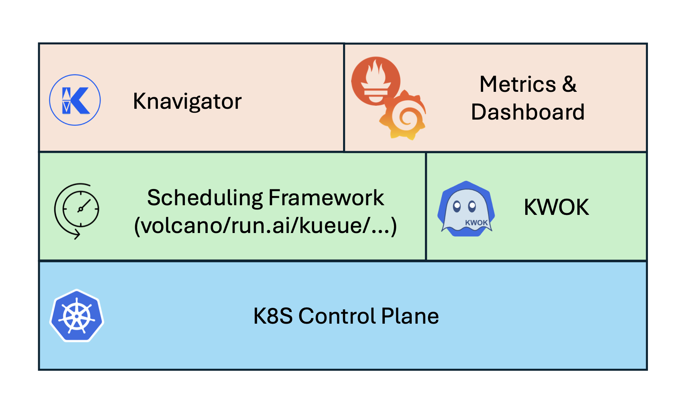

<p align="center"><a href="https://github.com/NVIDIA/knavigator" target="_blank"></a></p>

# Knavigator


## Overview

Knavigator is a project designed to analyze, optimize, and compare scheduling systems, with a focus on AI/ML workloads. It addresses various needs, including testing, troubleshooting, benchmarking, chaos engineering, performance analysis, and optimization.

The term "knavigator" is derived from "navigator," with a silent "k" prefix representing "kubernetes." Much like a navigator, this initiative assists in charting a secure route and steering clear of obstacles within the cluster.

Knavigator interfaces with Kubernetes clusters to manage tasks such as manipulating with Kubernetes objects, evaluating PromQL queries, as well as executing specific operations.

Knavigator can operate both outside and inside a Kubernetes cluster, leveraging the Kubernetes API for task management.

To facilitate large-scale experiments without the overhead of running actual user workloads, Knavigator utilizes [KWOK](https://kwok.sigs.k8s.io/) for creating virtual nodes in extensive clusters.

## Architecture



### Components

- **K8S control plane**: a set of components that manage the state and configuration of a vanilla Kubernetes cluster.
- **Scheduling Framework**: cloud-native job scheduling system for batch, HPC, AI/ML, and similar applications in a Kubernetes cluster.
- **KWOK**: Allows for the rapid setup of simulated Kubernetes clusters with minimal resource usage.
- **Knavigator**: Facilitates communication with the Kubernetes cluster via the Kubernetes API, enabling task management and data retrieval.
- **Metrics & Dashboard**: Gathers and processes metrics from the cluster, focusing on scheduling performance and resource utilization.

### Workflow

Knavigator offers versatile configuration options, allowing it to function independently, serve as an HTTP/gRPC server, or seamlessly integrate as a package or library within other systems.

In its standalone mode, Knavigator can be set up using a descriptive YAML file, where users specify the sequence of tasks to be executed. This mode is ideal for isolated testing scenarios where Knavigator operates independently.

Alternatively, in server or package configurations, Knavigator can receive a series of API calls to define the tasks to be performed. This mode facilitates integration with existing systems or frameworks, providing flexibility in how tasks are defined and managed.

Regardless of the configuration mode, Knavigator executes tasks sequentially. Each task is dependent on the successful completion of the preceding one. Therefore, if any task fails during execution, the entire test is marked as failed. This ensures comprehensive testing and accurate reporting of results, maintaining the integrity of the testing process.

### Getting started

#### Prerequisites

Ensure you have the following tools installed on your system before proceeding:

- [kind](https://kind.sigs.k8s.io/docs/user/quick-start/#installation): For creating local Kubernetes clusters

- [helm](https://helm.sh/docs/helm/helm_install/): The package manager for Kubernetes

- [kubectl](https://kubernetes.io/docs/tasks/tools/#kubectl): The Kubernetes command-line tool

Important notes:

- A real node (like kind's) is required for proper scheduling framework or workload manager functionality

- Deploying the workload manager on a virtual node will cause it to malfunction

- If you have existing virtual nodes or workloads, clean them up:

    ```bash
    kubectl delete node -l type=kwok
    ```

#### Installation

1. Clone the repository

    ```bash
    git clone git@github.com:MSSkowron/knavigator.git
    cd knavigator
    ```

2. Create and configure the test cluster

    ```bash
    ./scripts/create-test-cluster.sh
    ```

#### Monitoring Setup (Optional)

To access the Grafana dashboard:

1. Forward the Grafana service port

    ```bash
    kubectl port-forward -n monitoring svc/kube-prometheus-stack-grafana 8080:80
    ```

2. Access the Grafana dashboard

    - URL: <http://localhost:8080>

    - Default credentials:

        - Username: `admin`
        - Password: `admin`

To access the Prometheus dashboard:

1. Forward the Prometheus service port

    ```bash
    kubectl port-forward -n monitoring service/kube-prometheus-stack-prometheus 9090:9090
    ```

2. Access the Prometheus dashboard

    - URL: <http://localhost:9090>

#### Virtual Nodes

The cluster can be extended with virtual nodes using the provided Helm chart. These nodes can be customized based on your requirements.

##### Configuration

1. Navigate to the virtual nodes configuration file (`./charts/virtual-nodes/values.yaml`)

2. Define your virtual nodes by specifying:

    - Node type and count
    - Resource allocation (CPU, memory, GPUs)
    - Node labels and annotations
    - Custom conditions

##### Deployment

Deploy or update virtual nodes using Helm:

```bash
helm upgrade --install virtual-nodes charts/virtual-nodes -f charts/virtual-nodes/values.yaml
```

To verify the deployment:

```bash
kubectl get nodes
kubectl get node <node-name> -o yaml   # View detailed node configuration
```

To remove virtual nodes:

```bash
helm uninstall virtual-nodes
```

To update nodes configuration:

1. Modify `values.yaml`
2. Rerun the helm upgrade command

#### Using Knavigator

Knavigator requires the `KUBECONFIG` environment variable or the presence of the `-kubeconfig` (kube config) or `-kubectx` (kube context) command-line arguments.

1. Build the binary

    ```bash
    make build
    ```

2. Run a workflow

    ```bash
    ./bin/knavigator -workflow <workflow>
    ```

    Additionally, you can use the `-cleanup` flag to remove objects created by the test, and the `-v` flag to increase verbosity. For usage instructions, use the -h flag.

    ```bash
    ./bin/knavigator -workflow resources/workflows/k8s/test-job.yml -v 4 -cleanup
    ```

#### Creating a workflow

Workflows are defined in YAML files and consist of sequential tasks. Each task performs a specific operation like registering templates, configuring resources, or validating states.

Example workflows can be found in `./resources/workflows`.

##### Basic Structure

Every workflow YAML file follows this basic structure:

```yaml
name: test-name
description: description of the test
tasks:
- id: unique-task-id-1
  type: TaskType
  params:
    # task-specific parameters
- id: unique-task-id-2
  type: TaskType
  params:
    # task-specific parameters
...
```

Key Concepts:

- Each task must have a unique id
- Tasks are executed sequentially
- Tasks can reference other tasks using refTaskId
- Most tasks support timeout parameters

##### Task types

1. `RegisterObj`

    Registers Kubernetes object templates that will be used by other tasks in the workflow.

    ```yaml
    - id: register
    type: RegisterObj
    params:
        # Required: Path to the object template file (see examples in resources/templates/)
        template: "path/to/template.yaml"

        # Required: Go-template for generating unique object names
        # Uses _ENUM_ as an incrementing counter
        # The templated value is added to parameter map as _NAME_
        # Example: "job{{._ENUM_}}" generates: job1, job2, etc.
        nameFormat: "prefix{{._ENUM_}}"

        # Optional: Regular expression pattern for pod names
        # Uses _NAME_ to reference the parent object's name
        # Required when using CheckPod task
        # Example: "{{._NAME_}}-\d+-\S+" matches: job1-0-xyz, job1-1-abc
        podNameFormat: "{{._NAME_}}-[0-9]-.*"

        # Optional: Number of pods expected per object
        # Can be a fixed number or reference a template parameter
        # Required when using CheckPod task
        # Examples:
        #   - Fixed number: "2"
        #   - Template parameter: "{{.replicas}}"
        podCount: "{{.parallelism}}"
    ```

2. `SubmitObj`

    Creates Kubernetes objects from registered templates.

    ```yaml
    - id: submit-task
    type: SubmitObj
    params:
        # Required: References the ID of a RegisterObj task that defines the template
        refTaskId: string

        # Optional: Number of object instances to create (default: 1)
        # When count > 1, the referenced RegisterObj must specify nameFormat
        count: int

        # Optional: If true, doesn't error when object already exists
        canExist: boolean

        # Optional: Parameters used for template substitution
        # These values are used when executing object and name templates
        # Special parameter '_NAME_' is automatically added with the generated object name
        params:
            key1: value1
            key2: value2
    ```

3. `DeleteObj`

    Removes created objects.

    ```yaml
    - id: cleanup
    type: DeleteObj
    params:
        refTaskId: submit    # References object to delete
    ```

4. `Configure`

    Creates and configures various Kubernetes resources including virtual nodes, namespaces, configmaps, priority classes, and handles deployment restarts.

    ```yaml
    - id: configure
    type: Configure
    params:
        # Optional: Configure virtual nodes using Helm
        nodes:
        - type: string           # Required: Node type identifier
            count: int            # Required: Number of nodes to create
            annotations:          # Optional: Node annotations
            key: value
            labels:              # Optional: Node labels
            key: value
            conditions:          # Optional: Node conditions
            - key: value

        # Optional: Manage namespaces
        namespaces:
        - name: string         # Required: Namespace name
            op: string          # Required: Operation type (create/delete)

        # Optional: Manage configmaps
        configmaps:
        - name: string         # Required: ConfigMap name
            namespace: string    # Required: Namespace for the ConfigMap
            data:               # Required for create: ConfigMap data
            key: value
            op: string          # Required: Operation type (create/delete)

        # Optional: Manage priority classes
        priorityClasses:
        - name: string         # Required: PriorityClass name
            value: int          # Required for create: Priority value
            op: string          # Required: Operation type (create/delete)

        # Optional: Restart deployments
        deploymentRestarts:
        - name: string         # Optional: Deployment name (exclusive with labels)
            namespace: string    # Required: Namespace for the deployment
            labels:             # Optional: Deployment labels (exclusive with name)
            key: value

        # Required: Timeout duration for the entire configuration process
        timeout: duration       # Example: "1m", "5s"
    ```

5. `CheckObj`

    Validates object states and conditions.

    ```yaml
    - id: status
    type: CheckObj
    params:
        refTaskId: task-to-check
        state:
            status:
                key: value
        timeout: duration
    ```

6. `CheckPod`

   Specifically validates pod states.

    ```yaml
    - id: status
    type: CheckPod
    params:
        refTaskId: task-to-check
        status: Expected-Status
        nodeLabels:
            key: value
        timeout: duration
    ```

7. `Sleep`

    Introduces delays between tasks.

    ```yaml
    - id: sleep
    type: Sleep
    params:
        timeout: duration
    ```

##### Examples

1. Basic Job Test

    ```yaml
    name: test-k8s-job
    description: submit and validate a k8s job
    tasks:
    - id: register
    type: RegisterObj
    params:
        template: "resources/templates/k8s/job.yml"
        nameFormat: "job{{._ENUM_}}"
    - id: configure
    type: Configure
    params:
        nodes:
        - type: dgxa100.80g
        count: 2
        labels:
            nvidia.com/gpu.count: "8"
        timeout: 1m
    - id: job
    type: SubmitObj
    params:
        refTaskId: register
        count: 1
        params:
        namespace: default
        parallelism: 2
        completions: 2
        image: ubuntu
        cpu: 100m
        memory: 512M
    - id: status
    type: CheckPod
    params:
        refTaskId: job
        status: Running
        timeout: 5s
    ```

2. Preemption Test

    ```yaml
    name: test-preemption
    description: test scheduler preemption
    tasks:
    - id: register
    type: RegisterObj
    params:
        template: "resources/templates/job.yml"
    - id: configure
    type: Configure
    params:
        nodes:
        - type: dgxa100.80g
        count: 4
        priorityClasses:
        - name: high-priority
        value: 90
        - name: low-priority
        value: 30
    - id: low-priority-job
    type: SubmitObj
    params:
        refTaskId: register
        params:
        priority: low-priority
        # other job params
    - id: high-priority-job
    type: SubmitObj
    params:
        refTaskId: register
        params:
        priority: high-priority
        # other job params
    - id: check-preemption
    type: CheckObj
    params:
        refTaskId: low-priority-job
        state:
        status:
            ready: 0
        timeout: 5s
    ```

### Documentation

- [Deployment](docs/deployment.md)
- [Getting started](docs/getting_started.md)
- [Task management](docs/task_management.md)
- [Metrics and Dashboards](docs/metrics.md)
- [Benchmarking](resources/benchmarks/README.md)
