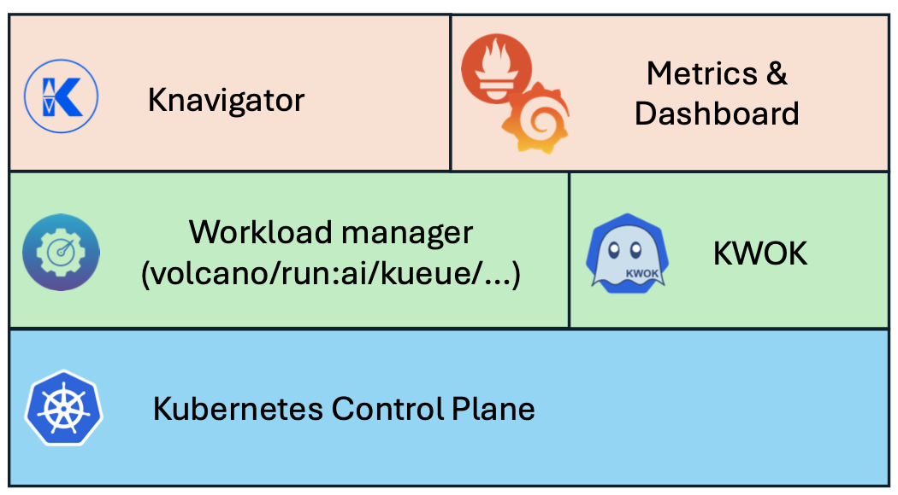

<p align="center"><a href="https://github.com/NVIDIA/knavigator" target="_blank"></a></p>

# Knavigator


## Overview

Knavigator is a project designed to analyze, optimize, and compare scheduling systems, with a focus on AI/ML workloads. It addresses various needs, including testing, troubleshooting, benchmarking, chaos engineering, performance analysis, and optimization.

The term "knavigator" is derived from "navigator," with a silent "k" prefix representing "kubernetes." Much like a navigator, this initiative assists in charting a secure route and steering clear of obstacles within the cluster.

Knavigator interfaces with Kubernetes clusters to manage tasks such as manipulating with Kubernetes objects, evaluating PromQL queries, as well as executing specific operations.

Knavigator can operate both outside and inside a Kubernetes cluster, leveraging the Kubernetes API for task management.

To facilitate large-scale experiments without the overhead of running actual user workloads, Knavigator utilizes [KWOK](https://kwok.sigs.k8s.io/) for creating virtual nodes in extensive clusters.

## Architecture



### Components

- **K8S control plane**: a set of components that manage the state and configuration of a vanilla Kubernetes cluster.
- **Scheduling Framework**: cloud-native job scheduling system for batch, HPC, AI/ML, and similar applications in a Kubernetes cluster.
- **KWOK**: Allows for the rapid setup of simulated Kubernetes clusters with minimal resource usage.
- **Knavigator**: Facilitates communication with the Kubernetes cluster via the Kubernetes API, enabling task management and data retrieval.
- **Metrics & Dashboard**: Gathers and processes metrics from the cluster, focusing on scheduling performance and resource utilization.

### Workflow

Knavigator offers versatile configuration options, allowing it to function independently, serve as an HTTP/gRPC server, or seamlessly integrate as a package or library within other systems.

In its standalone mode, Knavigator can be set up using a descriptive YAML file, where users specify the sequence of tasks to be executed. This mode is ideal for isolated testing scenarios where Knavigator operates independently.

Alternatively, in server or package configurations, Knavigator can receive a series of API calls to define the tasks to be performed. This mode facilitates integration with existing systems or frameworks, providing flexibility in how tasks are defined and managed.

Regardless of the configuration mode, Knavigator executes tasks sequentially. Each task is dependent on the successful completion of the preceding one. Therefore, if any task fails during execution, the entire test is marked as failed. This ensures comprehensive testing and accurate reporting of results, maintaining the integrity of the testing process.

### Getting started

#### Prerequisites

Ensure you have the following tools installed on your system before proceeding:

- [kind](https://kind.sigs.k8s.io/docs/user/quick-start/#installation): For creating local Kubernetes clusters

- [helm](https://helm.sh/docs/helm/helm_install/): The package manager for Kubernetes

- [kubectl](https://kubernetes.io/docs/tasks/tools/#kubectl): The Kubernetes command-line tool

Important notes:

- A real node (like kind's) is required for proper scheduling framework or workload manager functionality

- Deploying the workload manager on a virtual node will cause it to malfunction

- If you have existing virtual nodes or workloads, clean them up:

    ```bash
    kubectl delete node -l type=kwok
    ```

#### Installation

1. Clone the repository

    ```bash
    git clone git@github.com:MSSkowron/knavigator.git
    cd knavigator
    ```

2. Create and configure the test cluster

    ```bash
    ./scripts/create-test-cluster.sh
    ```

#### Monitoring Setup (Optional)

To access the Grafana dashboard for monitoring:

1. Forward the Grafana service port

    ```bash
    kubectl port-forward -n monitoring svc/kube-prometheus-stack-grafana 3000:80
    ```

2. Access the Grafana dashboard

    - URL: <http://localhost:3000>

    - Default credentials:

        - Username: `admin`
        - Password: `admin`

#### Nodes creation

TODO

```bash
helm upgrade --install virtual-nodes charts/virtual-nodes -f charts/virtual-nodes/values.yaml
```

#### Using Knavigator

TODO

### Documentation

- [Deployment](docs/deployment.md)
- [Getting started](docs/getting_started.md)
- [Task management](docs/task_management.md)
- [Metrics and Dashboards](docs/metrics.md)
- [Benchmarking](resources/benchmarks/README.md)
