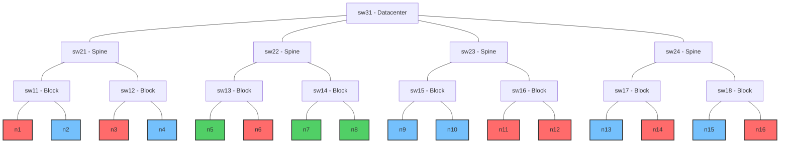
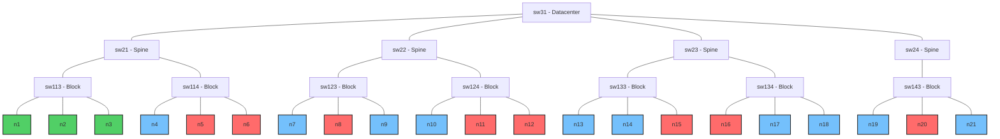
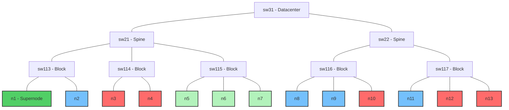

# Benchmarks

This directory contains benchmarks for comparing and evaluating the performance of the following workload management systems and schedulers:

- Kueue
- Volcano
- YuniKorn

## Performance, Scalability & Resource Utilization

Performance benchmarks provide a comprehensive evaluation of scheduler frameworks across different workload patterns, measuring throughput, scalability, and resource utilization efficiency. These tests simulate various scenarios that may occur in real production environments. All scenarios in this group use identical nodes with the following resources: **128 CPU cores**, **1TB RAM**, and **8 GPU accelerators**.

### V1: Large Number of Identical, Single-Pod Tasks

**Goal**: Efficiency in handling many single-pod tasks.

This benchmark tests the scheduler's ability to handle many identical, independent tasks. It measures the scheduler's performance, scalability, and resource utilization efficiency in processing multiple small tasks.

#### Configurations

The benchmark includes multiple configurations testing combinations of (nodes × tasks):

- **300×300**: 300 tasks on 300 nodes
- **400×400**: 400 tasks on 400 nodes
- **500×500**: 500 tasks on 500 nodes

Each test configuration uses:
- Virtual nodes, each with **128 CPU cores**, **1TB RAM**, and **8 GPUs**
- Sequential submission of tasks
- Independent jobs, where each consists of a single pod with requirements:
  - **16 CPU cores** (12.5% of node's CPU)
  - **256GB RAM** (25% of node's memory)
  - **4 GPUs** (50% of node's GPU)
- Pod lifetime: **5 minutes**

#### Cluster Resource Utilization

| Configuration | CPU Utilization | Memory Utilization | GPU Utilization |
| ------------- | --------------- | ------------------ | --------------- |
| 300×300       | 12.5%           | 25%                | 50%             |
| 400×400       | 12.5%           | 25%                | 50%             |
| 500×500       | 12.5%           | 25%                | 50%             |

The identical utilization percentages across configurations are intentional - they test scheduler scalability at constant resource pressure.

**Scripts to run**:

```bash
# For Kueue
./bin/knavigator -workflow "resources/benchmarks/performance/workflows/kueue-v1-300-300.yaml"
./bin/knavigator -workflow "resources/benchmarks/performance/workflows/kueue-v1-400-400.yaml"
./bin/knavigator -workflow "resources/benchmarks/performance/workflows/kueue-v1-500-500.yaml"

# For Volcano
./bin/knavigator -workflow "resources/benchmarks/performance/workflows/volcano-v1-300-300.yaml"
./bin/knavigator -workflow "resources/benchmarks/performance/workflows/volcano-v1-400-400.yaml"
./bin/knavigator -workflow "resources/benchmarks/performance/workflows/volcano-v1-500-500.yaml"

# For YuniKorn
./bin/knavigator -workflow "resources/benchmarks/performance/workflows/yunikorn-v1-300-300.yaml"
./bin/knavigator -workflow "resources/benchmarks/performance/workflows/yunikorn-v1-400-400.yaml"
./bin/knavigator -workflow "resources/benchmarks/performance/workflows/yunikorn-v1-500-500.yaml"
```

### V2: One Large Multi-Pod Job

**Goal**: Efficiency in handling jobs requiring multiple pod executions.

This benchmark tests the scheduler's efficiency in handling jobs consisting of multiple pods. It evaluates how well the scheduler manages large, cohesive workloads that require coordinated pod scheduling.

#### Configurations

The benchmark includes multiple configurations testing combinations of (nodes × pod replicas in single job):

- **300×300**: 1 job with 300 replicas on 300 nodes
- **400×400**: 1 job with 400 replicas on 400 nodes
- **500×500**: 1 job with 500 replicas on 500 nodes

Each test configuration uses:
- Virtual nodes, each with **128 CPU cores**, **1TB RAM**, and **8 GPUs**
- One multi-pod job submitted at once (unlike V1's sequential submission)
- Each pod replica requires:
  - **16 CPU cores** (12.5% of node's CPU)
  - **256GB RAM** (25% of node's memory)
  - **4 GPUs** (50% of node's GPU)
- Pod lifetime: **5 minutes**

#### Cluster Resource Utilization

| Configuration | CPU Utilization | Memory Utilization | GPU Utilization |
| ------------- | --------------- | ------------------ | --------------- |
| 300×300       | 12.5%           | 25%                | 50%             |
| 400×400       | 12.5%           | 25%                | 50%             |
| 500×500       | 12.5%           | 25%                | 50%             |

The key difference from V1 is testing the scheduler's ability to handle a single large job versus many small jobs at the same resource utilization level.

**Scripts to run**:

```bash
# For Kueue
./bin/knavigator -workflow "resources/benchmarks/performance/workflows/v2/kueue-v2-300-300.yaml"
./bin/knavigator -workflow "resources/benchmarks/performance/workflows/v2/kueue-v2-400-400.yaml"
./bin/knavigator -workflow "resources/benchmarks/performance/workflows/v2/kueue-v2-500-500.yaml"

# For Volcano
./bin/knavigator -workflow "resources/benchmarks/performance/workflows/v2/volcano-v2-300-300.yaml"
./bin/knavigator -workflow "resources/benchmarks/performance/workflows/v2/volcano-v2-400-400.yaml"
./bin/knavigator -workflow "resources/benchmarks/performance/workflows/v2/volcano-v2-500-500.yaml"

# For YuniKorn
./bin/knavigator -workflow "resources/benchmarks/performance/workflows/v2/yunikorn-v2-300-300.yaml"
./bin/knavigator -workflow "resources/benchmarks/performance/workflows/v2/yunikorn-v2-400-400.yaml"
./bin/knavigator -workflow "resources/benchmarks/performance/workflows/v2/yunikorn-v2-500-500.yaml"
```

### V3: Mixed Workload

**Goal**: Evaluate scheduler efficiency in managing heterogeneous workloads with varying resource characteristics under conditions simulating realistic operational environments.

This benchmark tests scheduler performance with diverse workloads running simultaneously. It evaluates how well the scheduler manages different types of tasks with varying resource requirements, simulating real-world cluster usage patterns.

#### Configurations

The benchmark includes multiple configurations testing combinations of (nodes × tasks of each type):

- **300×100**: 300 nodes with 100 tasks of each type (300 total)
- **400×200**: 400 nodes with 200 tasks of each type (600 total)
- **500×300**: 500 nodes with 300 tasks of each type (900 total)

Each test configuration uses:
- Virtual nodes, each with **128 CPU cores**, **1TB RAM**, and **8 GPUs**
- Three different types of single-pod tasks running in parallel:
  - **CPU-intensive tasks**: 32 CPU (25% of node), 128GB RAM (12.5% of node), **0 GPU**
  - **GPU-intensive tasks**: 16 CPU (12.5% of node), 96GB RAM (9.4% of node), **8 GPU** (100% of node)
  - **Mixed tasks**: 8 CPU (6.25% of node), 32GB RAM (3.1% of node), **2 GPU** (25% of node)
- Pod lifetime: **5 minutes**

#### Cluster Resource Utilization

| Configuration | Total CPU Utilization | Total Memory Utilization | Total GPU Utilization |
| ------------- | --------------------- | ------------------------ | --------------------- |
| 300×100       | 14.58%                | 8.33%                    | 41.67%                |
| 300×200       | 29.17%                | 16.67%                   | 83.33%                |
| 300×300       | 43.75%                | 25.00%                   | 125.00%*              |
| 400×200       | 21.88%                | 12.50%                   | 62.50%                |
| 400×300       | 32.81%                | 18.75%                   | 93.75%                |
| 500×300       | 26.25%                | 15.00%                   | 75.00%                |

*Note: 125% GPU utilization indicates over-subscription, testing scheduler behavior under resource contention.

**Scripts to run**:

```bash
# For Kueue
./bin/knavigator -workflow "resources/benchmarks/performance/workflows/v3/kueue-v3-300-100.yaml"
./bin/knavigator -workflow "resources/benchmarks/performance/workflows/v3/kueue-v3-400-200.yaml"
./bin/knavigator -workflow "resources/benchmarks/performance/workflows/v3/kueue-v3-500-300.yaml"

# For Volcano
./bin/knavigator -workflow "resources/benchmarks/performance/workflows/v3/volcano-v3-300-100.yaml"
./bin/knavigator -workflow "resources/benchmarks/performance/workflows/v3/volcano-v3-400-200.yaml"
./bin/knavigator -workflow "resources/benchmarks/performance/workflows/v3/volcano-v3-500-300.yaml"

# For YuniKorn
./bin/knavigator -workflow "resources/benchmarks/performance/workflows/v3/yunikorn-v3-300-100.yaml"
./bin/knavigator -workflow "resources/benchmarks/performance/workflows/v3/yunikorn-v3-400-200.yaml"
./bin/knavigator -workflow "resources/benchmarks/performance/workflows/v3/yunikorn-v3-500-300.yaml"
```

## Topology Awareness

Topology Awareness benchmarks evaluate the scheduler's ability to intelligently place pods based on network topology. This functionality is crucial for distributed workloads, such as deep learning training, where communication latency between pods can significantly impact performance.

The tests create a simulated network topology with different layers (datacenter, spine, block) and verify how well the scheduler can place pods to minimize network distances between cooperating pods.

Benchmarks are implemented for Kueue and Volcano, as YuniKorn does not currently support network topology-based scheduling.

**Node Color Coding in Topology Diagrams:**
- 🔴 **Red nodes**: Unschedulable nodes (marked as unavailable)
- 🟢 **Green nodes**: Optimal/target nodes for pod placement
- 🔵 **Blue nodes**: Regular available nodes
- 🟢 **Dark green (Supernode)**: High-capacity node in T3

### T1: Scheduling at Spine Level (Hierarchy Level 3)

This test configures 16 nodes in a tree structure representing a network topology with 4 hierarchy levels (Datacenter → Spine → Block → Node). To simulate more realistic conditions and force selection of a specific spine, 7 of 16 nodes are marked as unschedulable.



**Test**:
- Node configuration: 16 virtual nodes with network topology labels, each with 256 CPU, 2TB RAM, 8 GPU
- 7 nodes marked as unschedulable: n1, n3, n6, n11, n12, n14, n16
- Workload: Two sequential steps:
  1. Job with 3 pods using "required" (Kueue) / "hard" (Volcano) strategy at spine level
  2. Job with 3 pods using "preferred" (Kueue) / "soft" (Volcano) strategy at spine level
- Each pod requires: 16 CPU, 32GB RAM, 8 GPU (consuming all GPU resources of one node)
- Pod lifetime: 1 minute

**Expected Result**: In both steps, the scheduler should place all 3 pods on nodes n5, n7, n8, as they are the only available nodes belonging to the same spine (sw22) with sufficient resources.

**Scripts to run**:
```sh
# For Kueue
./bin/knavigator -workflow 'resources/benchmarks/topology-aware/workflows/kueue-v1.yaml'

# For Volcano
./bin/knavigator -workflow 'resources/benchmarks/topology-aware/workflows/volcano-v1.yaml'
```

### T2: Scheduling at Block Level (Hierarchy Level 2)

This test configures 21 nodes in a 4-level topology structure. To create a more selective environment, 8 of 21 nodes are marked as unschedulable, leaving only one block (sw113) with three available nodes (n1, n2, n3).



**Test**:
- Node configuration: 21 virtual nodes with network topology labels, each with 256 CPU, 2TB RAM, 8 GPU
- 8 nodes marked as unschedulable: n5, n6, n8, n11, n12, n15, n16, n20
- Workload: Two sequential steps:
  1. Job with 3 pods using "required" (Kueue) / "hard" (Volcano) strategy at block level
  2. Job with 3 pods using "preferred" (Kueue) / "soft" (Volcano) strategy at block level
- Each pod requires: 16 CPU, 32GB RAM, 8 GPU
- Pod lifetime: 1 minute

**Expected Result**: In both steps, the scheduler should place all 3 pods on nodes n1, n2, n3, as they are the only available nodes belonging to the same block (sw113).

**Scripts to run**:
```sh
# For Kueue
./bin/knavigator -workflow 'resources/benchmarks/topology-aware/workflows/kueue-v2.yaml'

# For Volcano
./bin/knavigator -workflow 'resources/benchmarks/topology-aware/workflows/volcano-v2.yaml'
```

### T3: Scheduling at Node Level (Hierarchy Level 1)

This test evaluates the scheduler's ability to consolidate all job pods on a single node when required, and to intelligently distribute pods across multiple nodes within the same lower-level topological domain when consolidation becomes impossible.



**Test Configuration**:
- 13 virtual nodes in 4-level topology, heterogeneous cluster:
  - One "supernode" (n1) in block sw113: 256 CPU, 2TB RAM, 24 GPU
  - Twelve regular nodes (n2-n13): 128 CPU, 1TB RAM, 8 GPU each
- 5 nodes marked as unschedulable: n3, n4, n10, n12, n13
- Workload: Two sequential steps:
  1. Job with 3 pods (each requiring 2 CPU, 2GB RAM, 6 GPU) with "required"/"hard" preference at hostname level
  2. After marking supernode as unschedulable, same job with "preferred"/"soft" preference

**Expected Result**:
- Step 1: All 3 pods should be placed on supernode n1 (only node capable of hosting 18 GPU total)
- Step 2: Pods should be distributed across three available nodes (n5, n6, n7) in block sw115

**Scripts to run**:
```sh
# For Kueue
./bin/knavigator -workflow 'resources/benchmarks/topology-aware/workflows/kueue-v3.yaml'

# For Volcano
./bin/knavigator -workflow 'resources/benchmarks/topology-aware/workflows/volcano-v3.yaml'
```

### T4: Scheduling Under Fragmentation and Competition

This benchmark evaluates topology-aware scheduling performance and quality in a more realistic scenario involving larger cluster scale, existing background workload causing resource fragmentation, and competition between tasks with different topological requirements.

**Topology**: 32 nodes in tree structure: 1 Datacenter, 2 Spines, 8 Blocks, 4 nodes per block. All nodes identical: 128 CPU, 1TB RAM, 8 GPU. Total: 4096 CPU, 32TB RAM, 256 GPU.

```mermaid
graph TD
    sw_dc1[sw-dc1 - Datacenter] --- sw_s1[sw-s1 - Spine]
    sw_dc1 --- sw_s2[sw-s2 - Spine]

    subgraph Spine sw-s1
        sw_s1 --- sw_b11[sw-b11 - Block]
        sw_s1 --- sw_b12[sw-b12 - Block]
        sw_s1 --- sw_b13[sw-b13 - Block]
        sw_s1 --- sw_b14[sw-b14 - Block]

        subgraph Block sw-b11
            sw_b11 --- n111[n111]
            sw_b11 --- n112[n112]
            sw_b11 --- n113[n113]
            sw_b11 --- n114[n114]
        end
        subgraph Block sw-b12
            sw_b12 --- n121[n121]
            sw_b12 --- n122[n122]
            sw_b12 --- n123[n123]
            sw_b12 --- n124[n124]
        end
        subgraph Block sw-b13
            sw_b13 --- n131[n131]
            sw_b13 --- n132[n132]
            sw_b13 --- n133[n133]
            sw_b13 --- n134[n134]
        end
        subgraph Block sw-b14
            sw_b14 --- n141[n141]
            sw_b14 --- n142[n142]
            sw_b14 --- n143[n143]
            sw_b14 --- n144[n144]
        end
    end

    subgraph Spine sw-s2
        sw_s2 --- sw_b21[sw-b21 - Block]
        sw_s2 --- sw_b22[sw-b22 - Block]
        sw_s2 --- sw_b23[sw-b23 - Block]
        sw_s2 --- sw_b24[sw-b24 - Block]

        subgraph Block sw-b21
            sw_b21 --- n211[n211]
            sw_b21 --- n212[n212]
            sw_b21 --- n213[n213]
            sw_b21 --- n214[n214]
        end
        subgraph Block sw-b22
            sw_b22 --- n221[n221]
            sw_b22 --- n222[n222]
            sw_b22 --- n223[n223]
            sw_b22 --- n224[n224]
        end
        subgraph Block sw-b23
            sw_b23 --- n231[n231]
            sw_b23 --- n232[n232]
            sw_b23 --- n233[n233]
            sw_b23 --- n234[n234]
        end
        subgraph Block sw-b24
            sw_b24 --- n241[n241]
            sw_b24 --- n242[n242]
            sw_b24 --- n243[n243]
            sw_b24 --- n244[n244]
        end
    end

    classDef computeNode fill:#74c0fc,stroke:#333,stroke-width:2px;
    class n111,n112,n113,n114,n121,n122,n123,n124,n131,n132,n133,n134,n141,n142,n143,n144,n211,n212,n213,n214,n221,n222,n223,n224,n231,n232,n233,n234,n241,n242,n243,n244 computeNode;
```



*Note: In this scenario there are no predefined unschedulable or optimal nodes; fragmentation is created dynamically by background tasks.*

**Test**:
- Step 1 (Fragmentation): 20 background jobs to create fragmentation:
  - 8 "Medium" jobs: 1 pod each, 32 CPU, 128GB RAM, 4 GPU
  - 12 "Small-MultiReplica" jobs: 4 pods each, 8 CPU, 32GB RAM, 2 GPU per pod
  - Total background: 640 CPU (15.6%), 2.5TB RAM (7.8%), 128 GPU (50%)
  - TTL: 10 minutes

- Step 2 (Task A - Required): 8 instances of Task A:
  - Each instance: 8 pods, 32 CPU, 128GB RAM, 5 GPU per pod
  - Total per instance: 256 CPU, 1TB RAM, 40 GPU
  - Hard requirement: all 8 pods within one spine
  - TTL: 2 minutes

- Step 3 (Task B - Preferred): 4 instances of Task B:
  - Each instance: 4 pods, 8 CPU, 32GB RAM, 3 GPU per pod
  - Total per instance: 32 CPU, 128GB RAM, 12 GPU
  - Soft preference: all 4 pods within one block
  - TTL: 2 minutes

**Expected Result**: Due to total GPU requirements exceeding capacity (496 GPU needed vs 256 available), significant portion of A and B instances will remain pending. The test evaluates scheduling success rate, waiting times, and placement quality.

**Scripts to run**:
```sh
# For Kueue
./bin/knavigator -workflow 'resources/benchmarks/topology-aware/workflows/kueue-v4.yaml'

# For Volcano
./bin/knavigator -workflow 'resources/benchmarks/topology-aware/workflows/volcano-v4.yaml'
```

## Fair Share

Benchmarks in this section evaluate schedulers' ability to fairly distribute cluster resources among different user groups (tenants) or job queues. They test various aspects of fair share mechanisms, including:

1. **Equal sharing** with identical weights (F1)
2. **Proportional sharing** based on defined weights (F2)
3. **Heterogeneous fairness** with Dominant Resource Fairness (DRF) principles (F3)
4. **Dynamic start priority vs. usage history** (F4)

Each scenario is tested in two variants: without resource guarantees (to observe "pure" fair share mechanism) and with guarantees (to examine interaction between fair share and guaranteed quotas).

### F1: Equal Sharing with Identical Weights

**Description**: Verifies whether the scheduler correctly implements equal resource sharing among tenants with identical weights and no resource guarantees.

**Configuration**:
- Cluster with 8 identical nodes, each with 16 CPU and 16GB RAM
- Total cluster resources: 128 CPU and 128GB RAM
- Eight tenants (tenant-a through tenant-h) with identical weights (1)
- Each task requires: 1 CPU and 1GB RAM
- Task lifetime: 5 minutes

**Test Execution**:
- Tasks submitted in three rounds with 30-second pauses between rounds:
  - Round 1: 10 tasks per tenant (80 total, 62.5% of cluster)
  - Round 2: 10 tasks per tenant (160 total cumulative, 125% of cluster)
  - Round 3: 10 tasks per tenant (240 total cumulative, 187.5% of cluster)

**Expected Result**:
- Each tenant should receive equal share (1/8) of cluster resources
- In steady state: 16 running pods per tenant
- Jain's Fairness Index (JFI) should be 1.0 (perfect equality)

**Test Variants**:
1. **Without guarantees**: Pure fair sharing based on weights only
2. **With guarantees**: Each tenant guaranteed 1/8 of cluster resources (16 CPU, 16GB RAM)

**Scripts to run**:
```sh
# Without guarantees
./bin/knavigator -workflow 'resources/benchmarks/fair-share/workflows/kueue-v1-no-guarantees.yaml'
./bin/knavigator -workflow 'resources/benchmarks/fair-share/workflows/volcano-v1-no-guarantees.yaml'
./bin/knavigator -workflow 'resources/benchmarks/fair-share/workflows/yunikorn-v1-no-guarantees.yaml'

# With guarantees
./bin/knavigator -workflow 'resources/benchmarks/fair-share/workflows/kueue-v1-guarantees.yaml'
./bin/knavigator -workflow 'resources/benchmarks/fair-share/workflows/volcano-v1-guarantees.yaml'
./bin/knavigator -workflow 'resources/benchmarks/fair-share/workflows/yunikorn-v1-guarantees.yaml'
```

### F2: Proportional Sharing with Different Weights

**Description**: Verifies proportional resource distribution based on different tenant weights.

**Configuration**:
- Cluster with 10 identical nodes, each with 12 CPU and 12GB RAM
- Total cluster resources: 120 CPU and 120GB RAM
- Six tenants with different weights:
  - Tenant A: weight 4
  - Tenant B: weight 3
  - Tenants C & D: weight 2 each
  - Tenants E & F: weight 1 each
  - Total weight units: 13
- Each task requires: 1 CPU and 1GB RAM
- Task lifetime: 5 minutes

**Test Execution**:
- Tasks submitted in three rounds with 30-second pauses:
  - Tenants A-B: 20 tasks per round
  - Tenants C-D: 15 tasks per round
  - Tenants E-F: 10 tasks per round
- Total demand after round 3: 270 tasks (225% of cluster capacity)

**Expected Result**:
- Resource allocation proportional to weights:
  - Tenant A: 37 pods (4/13 ≈ 30.8%)
  - Tenant B: 28 pods (3/13 ≈ 23.1%)
  - Tenant C: 19 pods (2/13 ≈ 15.4%)
  - Tenant D: 18 pods (2/13 ≈ 15.4%)
  - Tenants E & F: 9 pods each (1/13 ≈ 7.7%)
- Jain's Fairness Index ≈ 0.80

**Scripts to run**:
```sh
# Without guarantees
./bin/knavigator -workflow 'resources/benchmarks/fair-share/workflows/kueue-v2-no-guarantees.yaml'
./bin/knavigator -workflow 'resources/benchmarks/fair-share/workflows/volcano-v2-no-guarantees.yaml'
./bin/knavigator -workflow 'resources/benchmarks/fair-share/workflows/yunikorn-v2-no-guarantees.yaml'

# With guarantees
./bin/knavigator -workflow 'resources/benchmarks/fair-share/workflows/kueue-v2-guarantees.yaml'
./bin/knavigator -workflow 'resources/benchmarks/fair-share/workflows/volcano-v2-guarantees.yaml'
./bin/knavigator -workflow 'resources/benchmarks/fair-share/workflows/yunikorn-v2-guarantees.yaml'
```

### F3: Heterogeneous Fairness

**Description**: Evaluates fairness in environments with multiple resource types and tenants with different dominant resources, using Dominant Resource Fairness (DRF) principles as the ideal fairness benchmark.

**Configuration**:
- Heterogeneous cluster with 18 nodes:
  - 6 CPU-heavy nodes: 64 CPU, 64GB RAM, 0 GPU each
  - 6 RAM-heavy nodes: 16 CPU, 256GB RAM, 0 GPU each
  - 6 GPU-enabled nodes: 16 CPU, 64GB RAM, 8 GPU each
- Total cluster resources: 576 CPU, 2304GB RAM, 48 GPU
- Six tenants with equal weights but different task profiles:
  - Tenants A1 & A2 (CPU-intensive): Tasks require 8 CPU, 8GB RAM, 0 GPU
  - Tenants B1 & B2 (RAM-intensive): Tasks require 2 CPU, 32GB RAM, 0 GPU
  - Tenants C1 & C2 (GPU-intensive): Tasks require 2 CPU, 8GB RAM, 1 GPU

**Test Execution**:
- Two rounds with 30-second pause:
  - Tenants A1, A2, B1, B2: 40 tasks per round each
  - Tenants C1, C2: 25 tasks per round each
- Task lifetime: 5 minutes

**Expected Result (DRF-based)**:
- Equal dominant resource share (33.33%) for each tenant
- Expected running tasks in equilibrium:
  - Tenants A1 & A2: 24 tasks each
  - Tenants B1 & B2: 24 tasks each
  - Tenants C1 & C2: 16 tasks each
- Expected JFI values:
  - JFI_CPU ≈ 0.614
  - JFI_RAM ≈ 0.614
  - JFI_GPU ≈ 0.333 (lower due to only 2/6 tenants using GPU)

**Scripts to run**:
```sh
./bin/knavigator -workflow 'resources/benchmarks/fair-share/workflows/kueue-v3.yaml'
./bin/knavigator -workflow 'resources/benchmarks/fair-share/workflows/volcano-v3.yaml'
./bin/knavigator -workflow 'resources/benchmarks/fair-share/workflows/yunikorn-v3.yaml'
```

### F4: Dynamic Start Priority vs. Usage History

**Description**: Verifies whether fair share mechanisms consider historical resource usage when prioritizing newly submitted tasks, temporarily favoring tenants who have historically consumed fewer resources.

**Configuration**:
- Cluster with 10 identical nodes, each with 10 CPU and 10GB RAM
- Total cluster resources: 100 CPU and 100GB RAM
- Six tenants (tenant-a through tenant-f) with equal weights
- Each task requires: 1 CPU and 1GB RAM

**Test Phases**:
1. **Phase 1 - Building Usage History (10 minutes)**:
   - Every 10 seconds:
     - Tenant A: submits 8 tasks
     - Tenant B: submits 5 tasks
     - Tenant C: submits 3 tasks
     - Tenant D: submits 1 task
     - Tenants E & F: submit 0 tasks
   - Task lifetime: 60 seconds

2. **Stabilization Pause (60 seconds)**

3. **Phase 2 - Prioritization Test**:
   - All tenants simultaneously submit 40 tasks each (240 total)
   - Task lifetime: 5 minutes
   - Observe initial task acceptance rates

**Expected Result**:
- Initial prioritization in Phase 2 should favor tenants with lower historical usage:
  - Tenants E & F (zero historical usage) should receive highest priority
  - Tenant D (minimal usage) should receive moderate priority
  - Tenants C, B, A should receive progressively lower priority
- Over time, this initial preference should diminish as the system converges toward equal distribution

**Scripts to run**:
```sh
# For Kueue
./bin/knavigator -workflow 'resources/benchmarks/fair-share/workflows/kueue-v4.yaml'
./bin/knavigator -workflow 'resources/benchmarks/fair-share/workflows/volcano-v4.yaml'
./bin/knavigator -workflow 'resources/benchmarks/fair-share/workflows/yunikorn-v4.yaml'
```