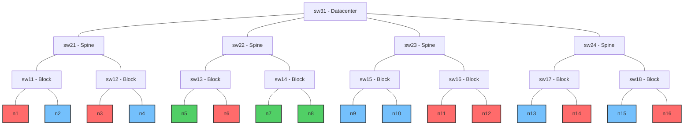
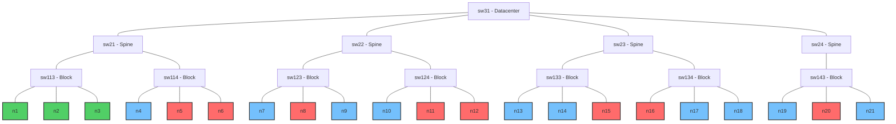
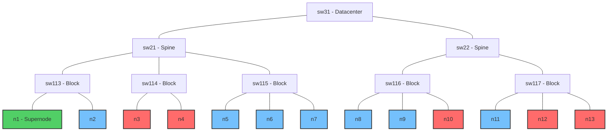

# Benchmark Tests

This directory contains benchmark tests for the following workload managers and schedulers:

- Kueue
- Volcano
- Yunikorn

The benchmark tests involve submitting workloads intended to evaluate the scheduler's performance under specific scenarios.

## Performance

The performance benchmarks provide a comprehensive evaluation of scheduling frameworks under different workload patterns, measuring throughput, scalability, and effectiveness of resource bin-packing. These tests simulate various real-world scenarios to assess how each scheduler responds to different types of demand.

### V1: Large number of identical, independent jobs

This benchmark tests the scheduler's ability to handle a large number of identical, independent jobs.

**Test Configuration**:

- 700 virtual nodes with 128 CPU cores, 1Ti memory, and 8 GPUs each
- 700 jobs, where each job submits a single pod with moderate resource requirements:

  - 16 CPU cores (12.5% of a node)
  - 256Gi memory (25% of a node)
  - 4 GPUs (50% of a node)

**For Kueue**:

```bash
./bin/knavigator -workflow "./resources/benchmarks/performance/workflows/{kueue-v1.yaml}" -v 4
```

**For Volcano**:

```bash
./bin/knavigator -workflow "./resources/benchmarks/performance/workflows/{volcano-v1.yaml}" -v 4
```

**For YuniKorn**:

```bash
./bin/knavigator -workflow "./resources/benchmarks/performance/workflows/{yunikorn-v1.yaml}" -v 4
```

### V2: One large multi-pod job

This benchmark tests the scheduler's efficiency when handling multi-pod jobs.

**Test Configuration**:

- 700 virtual nodes with 128 CPU cores, 1Ti memory, and 8 GPUs each
- A single job that creates 700 pods, each with:

  - 16 CPU cores (12.5% of a node)
  - 256Gi memory (25% of a node)
  - 4 GPUs (50% of a node)

**For Kueue**:

```bash
./bin/knavigator -workflow "./resources/benchmarks/performance/workflows/{kueue-v2.yaml}" -v 4
```

**For Volcano**:

```bash
./bin/knavigator -workflow "./resources/benchmarks/performance/workflows/{volcano-v2.yaml}" -v 4
```

**For YuniKorn**:

```bash
./bin/knavigator -workflow "./resources/benchmarks/performance/workflows/{yunikorn-v2.yaml}" -v 4
```

### V3: Mixed workload

This benchmark tests scheduler performance with diverse workloads that better represent real-world cluster usage patterns. It evaluates how well schedulers can handle heterogeneous job types with different resource requirements simultaneously.

**Test Configuration**:

- 700 virtual nodes with 128 CPU cores, 1Ti memory, and 8 GPUs each
- Three distinct job types submitted in parallel:

  - **High-GPU Jobs**: 300 jobs using full GPU nodes (8 GPUs per job)

    - 16 CPU cores (12.5% of a node)
    - 96Gi memory (9.4% of a node)
    - 8 GPUs (100% of a node)

  - **Medium-GPU Jobs**: 200 jobs with partial GPU usage (2 GPUs per job)

    - 8 CPU cores (6.25% of a node)
    - 32Gi memory (3.1% of a node)
    - 2 GPUs (25% of a node)

  - **CPU-Only Jobs**: 200 jobs with no GPU requirements

    - 32 CPU cores (25% of a node)
    - 128Gi memory (12.5% of a node)
    - 0 GPUs

**For Kueue**:

```bash
./bin/knavigator -workflow "./resources/benchmarks/performance/workflows/{kueue-v3.yaml}" -v 4
```

**For Volcano**:

```bash
./bin/knavigator -workflow "./resources/benchmarks/performance/workflows/{volcano-v3.yaml}" -v 4
```

**For YuniKorn**:

```bash
./bin/knavigator -workflow "./resources/benchmarks/performance/workflows/{yunikorn-v3.yaml}" -v 4
```

## Topology Aware

The topology aware benchmark evaluates a scheduler's ability to intelligently place pods based on topology considerations. This capability is crucial for distributed workloads like deep learning training, where inter-pod communication latency can significantly impact performance.

This benchmark creates a simulated network topology with various layers (e.g. datacenter, spine, block) and tests how well each scheduler can place pods to minimize network distances between collaborating pods.

### V1

The benchmark configures 16 nodes with a tree-like network topology:



In this diagram:

- Nodes n1, n3, n6, n11, n12, n14, and n16 are marked as unschedulable (X)
- Nodes n5, n7, and n8 are marked as "optimal" for network topology considerations

**Test**:

- **Node Setup**: The test creates 16 virtual nodes with network topology labels at different levels:

  - network.topology.kubernetes.io/datacenter: Top-level network segment
  - network.topology.kubernetes.io/spine: Mid-level network segment
  - network.topology.kubernetes.io/block: Low-level network segment

- **Workload**: A job with 3 pods requiring co-location for optimal performance is submitted to the cluster using the *"preferred"*/*"soft"* topology strategy at the block level (`network.topology.kubernetes.io/block`).

- **Evaluation**: Success is measured by whether the scheduler places all 3 pods on the optimal nodes (n5, n7, n8) that have been marked with net-optimal: true and have the lowest network distance between them.

To run the benchmark test for Kueue:

```sh
./bin/knavigator -workflow 'resources/benchmarks/topology-aware/workflows/{kueue-v1.yaml}'
```

### V2

The benchmark configures 21 nodes with a more complex tree-like network topology:



In this diagram:

- Nodes n5, n6, n8, n11, n12, n15, n16, and n20 are marked as unschedulable (X)
- Nodes n1, n2, and n3 are all within the same network block (sw113) and are marked as "optimal"

Test:

- **Node Setup**: Similar to V1, but with a different topology structure where the optimal nodes are all within the same network block, providing the lowest possible latency for inter-pod communication.

- **Workload**: The test runs two sequential scheduling tests at the block level (`network.topology.kubernetes.io/block`):

  - A job with 3 pods using *"preferred"*/*"soft"* topology scheduling (soft constraint that the scheduler should try to satisfy)
  - A job with 3 pods using *"required"*/*"hard"* topology scheduling (hard constraint that must be satisfied for scheduling)

- **Evaluation**: Success is measured by whether the scheduler places all pods on the optimal nodes (n1, n2, n3) for both scheduling modes. This tests both the scheduler's ability to honor topology preferences when possible and to enforce strict topology requirements when necessary.

To run the benchmark test for Kueue:

```sh
./bin/knavigator -workflow 'resources/benchmarks/topology-aware/workflows/{kueue-v3.yaml}'
```

### V3

The benchmark configures 7 nodes with a network topology that includes a "supernode" with high capacity and multiple regular nodes:



In this diagram:

- Node n1 is a high-capacity "supernode" capable of hosting all pods of a job
- Nodes n3, n4, n10, n12, and n13 are marked as unschedulable (×)
- Block sw116 has 2 available nodes (n8, n9) and 1 unavailable (n10)
- Block sw117 has 1 available node (n11) and 2 unavailable (n12, n13)
- All nodes in block sw115 (n5, n6, n7) are available for scheduling

**Test**:

1. **Phase 1 - Single Node Placement**:
   - The test creates a job with 3 pods requiring co-location at the block level
   - With the supernode available, all pods should be scheduled on the same node (n1)
   - This tests Kueue's preference for consolidating pods on a single node when topology constraints allow

2. **Phase 2 - Distributed Placement**:
   - The supernode is then marked as unschedulable
   - A new job with the same requirements is submitted
   - Pods should now be distributed across the available nodes in block sw115 (n5, n6, n7)
   - This tests Kueue's ability to distribute pods within the same network block when a single node isn't available

3. **Evaluation**:
   - Success is measured by whether Kueue correctly places all pods on the supernode in phase 1
   - And whether it distributes pods across multiple nodes within the same block in phase 2

This test validates Kueue's ability to make smart placement decisions while still respecting topology constraints, both when consolidation is possible and when distribution is necessary.

To run the benchmark test for Kueue:

```sh
./bin/knavigator -workflow 'resources/benchmarks/topology-aware/workflows/{kueue-v3.yaml}'
```

## Fair Share

TODO
