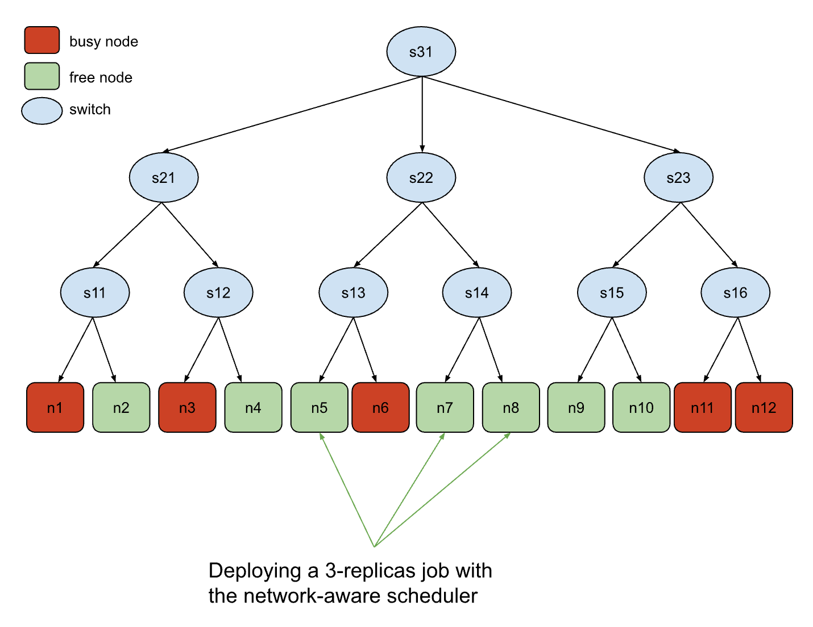

# Benchmark Tests

This directory contains benchmark tests for the following workload managers and schedulers:

- Kueue
- Volcano
- Yunikorn

The benchmark tests involve submitting workloads intended to evaluate the scheduler's performance under specific scenarios.

These workloads are designed to fully utilize the cluster under optimal scheduling conditions.

One approach to benchmarking is to run this workload on clusters with different schedulers and then compare the average GPU occupancy of the nodes.

For all workload managers, the benchmark test involves two sequential workflows. The first workflow registers the CRDs, and the second workflow runs the common part of the test.

## Gang Scheduling Benchmark

Gang scheduling is a critical capability for AI and ML workloads where all pods in a job must be scheduled simultaneously to prevent resource deadlocks and inefficiencies.

The benchmark workflow operates on 32 virtual GPU nodes, submitting a burst of 53 jobs with replica numbers ranging from 1 to 32 in a [predetermined order](gang-scheduling/workflows/run-test.yaml).

For Kueue:

```bash
./bin/knavigator -workflow "./resources/benchmarks/gang-scheduling/workflows/{config-nodes.yaml,config-kueue.yaml,run-test.yaml}"
```

For Volcano:

```bash
./bin/knavigator -workflow "./resources/benchmarks/gang-scheduling/workflows/{config-nodes.yaml,config-volcano.yaml,run-test.yaml}"
```

For YuniKorn:

```bash
./bin/knavigator -workflow "./resources/benchmarks/gang-scheduling/workflows/{config-nodes.yaml,config-yunikorn.yaml,run-test.yaml}"
```

For Coscheduling:

```bash
./bin/knavigator -workflow "./resources/benchmarks/gang-scheduling/workflows/{config-nodes.yaml,config-combo-coscheduling.yaml,run-test.yaml}"
```

## Performance

The performance benchmarks provide a comprehensive evaluation of scheduling frameworks under different workload patterns, measuring throughput, scalability, and effectiveness of resource bin-packing. These tests simulate various real-world scenarios to assess how each scheduler responds to different types of demand.

### V1: Large number of identical, independent jobs

This benchmark tests the scheduler's ability to handle a large number of identical, independent jobs.

**Test Configuration**:

- 700 virtual nodes with 128 CPU cores, 1Ti memory, and 8 GPUs each
- 700 jobs, where each job submits a single pod with moderate resource requirements:

  - 16 CPU cores (12.5% of a node)
  - 256Gi memory (25% of a node)
  - 4 GPUs (50% of a node)

**For Kueue**:

```bash
./bin/knavigator -workflow "./resources/benchmarks/performance/workflows/{kueue-v1.yaml}" -v 4
```

**For Volcano**:

```bash
./bin/knavigator -workflow "./resources/benchmarks/performance/workflows/{volcano-v1.yaml}" -v 4
```

**For YuniKorn**:

```bash
./bin/knavigator -workflow "./resources/benchmarks/performance/workflows/{yunikorn-v1.yaml}" -v 4
```

### V2: One large multi-pod job

This benchmark tests the scheduler's efficiency when handling multi-pod jobs.

**Test Configuration**:

- 700 virtual nodes with 128 CPU cores, 1Ti memory, and 8 GPUs each
- A single job that creates 700 pods, each with:

  - 16 CPU cores (12.5% of a node)
  - 256Gi memory (25% of a node)
  - 4 GPUs (50% of a node)

**For Kueue**:

```bash
./bin/knavigator -workflow "./resources/benchmarks/performance/workflows/{kueue-v2.yaml}" -v 4
```

**For Volcano**:

```bash
./bin/knavigator -workflow "./resources/benchmarks/performance/workflows/{volcano-v2.yaml}" -v 4
```

**For YuniKorn**:

```bash
./bin/knavigator -workflow "./resources/benchmarks/performance/workflows/{yunikorn-v2.yaml}" -v 4
```

### V3: Mixed workload

This benchmark tests scheduler performance with diverse workloads that better represent real-world cluster usage patterns. It evaluates how well schedulers can handle heterogeneous job types with different resource requirements simultaneously.

**Test Configuration**:

- 700 virtual nodes with 128 CPU cores, 1Ti memory, and 8 GPUs each
- Three distinct job types submitted in parallel:

  - **High-GPU Jobs**: 300 jobs using full GPU nodes (8 GPUs per job)

    - 16 CPU cores (12.5% of a node)
    - 96Gi memory (9.4% of a node)
    - 8 GPUs (100% of a node)

  - **Medium-GPU Jobs**: 200 jobs with partial GPU usage (2 GPUs per job)

    - 8 CPU cores (6.25% of a node)
    - 32Gi memory (3.1% of a node)
    - 2 GPUs (25% of a node)

  - **CPU-Only Jobs**: 200 jobs with no GPU requirements

    - 32 CPU cores (25% of a node)
    - 128Gi memory (12.5% of a node)
    - 0 GPUs

**For Kueue**:

```bash
./bin/knavigator -workflow "./resources/benchmarks/performance/workflows/{kueue-v3.yaml}" -v 4
```

**For Volcano**:

```bash
./bin/knavigator -workflow "./resources/benchmarks/performance/workflows/{volcano-v3.yaml}" -v 4
```

**For YuniKorn**:

```bash
./bin/knavigator -workflow "./resources/benchmarks/performance/workflows/{yunikorn-v3.yaml}" -v 4
```

## Topology Aware Benchmark

The topology aware benchmark evaluates a scheduler's ability to intelligently place pods based on topology considerations. This capability is crucial for distributed workloads like deep learning training, where inter-pod communication latency can significantly impact performance.

This benchmark creates a simulated network topology with various layers (datacenter, spine, block, accelerator) and tests how well each scheduler can place pods to minimize network distances between collaborating pods.

### Topology Structure

The benchmark configures 12 nodes with a tree-like network topology:



In this diagram:

- Nodes n1, n3, n6, n11, and n12 are marked as unschedulable (X)
- Nodes n5, n7, and n8 are marked as "optimal" for network topology considerations

### Test Methodology

- **Node Setup**: The test creates 12 virtual nodes with network topology labels at different levels:

  - network.topology.kubernetes.io/datacenter: Top-level network segment
  - network.topology.kubernetes.io/spine: Mid-level network segment
  - network.topology.kubernetes.io/block: Low-level network segment
  - Some configurations also include network.topology.kubernetes.io/accelerator for NVLink-aware scheduling

- **Workload**: A job with 3 pods requiring co-location for optimal performance is submitted to the cluster.

- **Evaluation**: Success is measured by whether the scheduler places all 3 pods on the optimal nodes (n5, n7, n8) that have been marked with net-optimal: true and have the lowest network distance between them.

### Examples

To run the benchmark test for Run:ai:

```sh
./bin/knavigator -workflow 'resources/benchmarks/nwtopo/workflows/{config-nodes.yaml,runai-test.yaml}'
```

To run the benchmark test for Jobset:

```sh
./bin/knavigator -workflow 'resources/benchmarks/nwtopo/workflows/{config-nodes.yaml,config-jobset.yaml,run-test.yaml}'
```

```sh
./bin/knavigator -workflow 'resources/benchmarks/nwtopo/workflows/{config-nodes-acc.yaml,config-jobset-acc.yaml,run-test-acc.yaml}'
```

## Fair Share Benchmark

TODO
