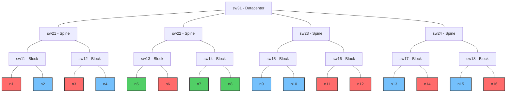
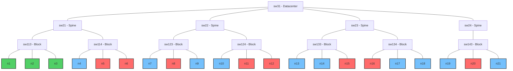
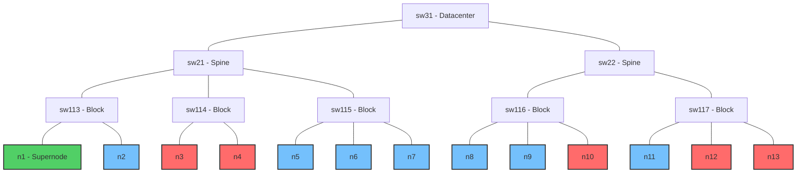

# Benchmark Tests

This directory contains benchmark tests for the following workload managers and schedulers:

- Kueue
- Volcano
- Yunikorn

The benchmark tests involve submitting workloads intended to evaluate the scheduler's performance under specific scenarios.

## Performance

The performance benchmarks provide a comprehensive evaluation of scheduling frameworks under different workload patterns, measuring throughput, scalability, and effectiveness of resource bin-packing. These tests simulate various real-world scenarios to assess how each scheduler responds to different types of demand.

### V1: Large number of identical, independent jobs

This benchmark tests the scheduler's ability to handle a large number of identical, independent jobs.

**Test Configuration**:

- 700 virtual nodes with 128 CPU cores, 1Ti memory, and 8 GPUs each
- 700 jobs, where each job submits a single pod with moderate resource requirements:

  - 16 CPU cores (12.5% of a node)
  - 256Gi memory (25% of a node)
  - 4 GPUs (50% of a node)

**For Kueue**:

```bash
./bin/knavigator -workflow "./resources/benchmarks/performance/workflows/{kueue-v1.yaml}" -v 4
```

**For Volcano**:

```bash
./bin/knavigator -workflow "./resources/benchmarks/performance/workflows/{volcano-v1.yaml}" -v 4
```

**For YuniKorn**:

```bash
./bin/knavigator -workflow "./resources/benchmarks/performance/workflows/{yunikorn-v1.yaml}" -v 4
```

### V2: One large multi-pod job

This benchmark tests the scheduler's efficiency when handling multi-pod jobs.

**Test Configuration**:

- 700 virtual nodes with 128 CPU cores, 1Ti memory, and 8 GPUs each
- A single job that creates 700 pods, each with:

  - 16 CPU cores (12.5% of a node)
  - 256Gi memory (25% of a node)
  - 4 GPUs (50% of a node)

**For Kueue**:

```bash
./bin/knavigator -workflow "./resources/benchmarks/performance/workflows/{kueue-v2.yaml}" -v 4
```

**For Volcano**:

```bash
./bin/knavigator -workflow "./resources/benchmarks/performance/workflows/{volcano-v2.yaml}" -v 4
```

**For YuniKorn**:

```bash
./bin/knavigator -workflow "./resources/benchmarks/performance/workflows/{yunikorn-v2.yaml}" -v 4
```

### V3: Mixed workload

This benchmark tests scheduler performance with diverse workloads that better represent real-world cluster usage patterns. It evaluates how well schedulers can handle heterogeneous job types with different resource requirements simultaneously.

**Test Configuration**:

- 700 virtual nodes with 128 CPU cores, 1Ti memory, and 8 GPUs each
- Three distinct job types submitted in parallel:

  - **High-GPU Jobs**: 300 jobs using full GPU nodes (8 GPUs per job)

    - 16 CPU cores (12.5% of a node)
    - 96Gi memory (9.4% of a node)
    - 8 GPUs (100% of a node)

  - **Medium-GPU Jobs**: 200 jobs with partial GPU usage (2 GPUs per job)

    - 8 CPU cores (6.25% of a node)
    - 32Gi memory (3.1% of a node)
    - 2 GPUs (25% of a node)

  - **CPU-Only Jobs**: 200 jobs with no GPU requirements

    - 32 CPU cores (25% of a node)
    - 128Gi memory (12.5% of a node)
    - 0 GPUs

**For Kueue**:

```bash
./bin/knavigator -workflow "./resources/benchmarks/performance/workflows/{kueue-v3.yaml}" -v 4
```

**For Volcano**:

```bash
./bin/knavigator -workflow "./resources/benchmarks/performance/workflows/{volcano-v3.yaml}" -v 4
```

**For YuniKorn**:

```bash
./bin/knavigator -workflow "./resources/benchmarks/performance/workflows/{yunikorn-v3.yaml}" -v 4
```

## Topology Aware

Benchmark Topology Aware ocenia zdolność schedulera do inteligentnego rozmieszczania podów w oparciu o topologię sieci. Ta funkcjonalność jest kluczowa dla rozproszonych obciążeń, takich jak trening deep learning, gdzie opóźnienie komunikacji między podami może znacząco wpływać na wydajność.

Testy tworzą symulowaną topologię sieci z różnymi warstwami (datacenter, spine, block) i sprawdzają, jak dobrze scheduler potrafi umieszczać pody, aby zminimalizować odległości sieciowe między współpracującymi podami.

Benchmarki są zaimplementowane tylko dla Kueue i Volcano, ponieważ YuniKorn nie wspiera obecnie planowania opartego na topologii sieci.

### V1: Planowanie na 2 poziomie hierarchii (spine)

Test konfiguruje 16 węzłów w układzie drzewiastym reprezentującym topologię sieci:



Na tym diagramie:

- Węzły n1, n3, n6, n11, n12, n14 i n16 są oznaczone jako nieplanowalne (X)
- Węzły n5, n7 i n8 są oznaczone jako "optymalne" ze względu na topologię sieci (pod sw22)

**Test**:

- **Konfiguracja węzłów**: Test tworzy 16 wirtualnych węzłów z etykietami topologii sieci na różnych poziomach:

  - network.topology.kubernetes.io/datacenter: Segment sieci najwyższego poziomu
  - network.topology.kubernetes.io/spine: Segment sieci średniego poziomu
  - network.topology.kubernetes.io/block: Segment sieci najniższego poziomu

- **Obciążenie: Test przeprowadza dwie fazy**:

  - Uruchamia job z 3 podami używając strategii *"required" (Kueue) / "hard" (Volcano)* na poziomie spine
  - Uruchamia ten sam job z 3 podami używając strategii *"preferred" (Kueue) / "soft" (Volcano)* na poziomie spine

- **Ocena**: Sukces jest mierzony zdolnością schedulera do umieszczenia wszystkich podów na optymalnych węzłach (n5, n7, n8), które zostały oznaczone etykietą "net-optimal: true" i mają najmniejszą odległość sieciową między sobą.

Aby uruchomić benchmark dla Kueue:

```sh
./bin/knavigator -workflow 'resources/benchmarks/topology-aware/workflows/{kueue-v1.yaml}'
```

Aby uruchomić benchmark dla Volcano:

```sh
./bin/knavigator -workflow 'resources/benchmarks/topology-aware/workflows/{volcano-v1.yaml}'
```

### V2: Planowanie na 1 poziomie hierarchii (block)

Benchmark konfiguruje 21 węzłów w bardziej złożonym układzie drzewiastym:



Na tym diagramie:

- Węzły n5, n6, n8, n11, n12, n15, n16 i n20 są oznaczone jako nieplanowalne (X)
- Węzły n1, n2 i n3 znajdują się w tym samym bloku sieci (sw113) i są oznaczone jako "optymalne"

**Test**:

- **Konfiguracja węzłów**: Podobna do V1, ale z inną strukturą topologii, gdzie optymalne węzły znajdują się wszystkie w tym samym bloku sieci, zapewniając najmniejsze możliwe opóźnienie dla komunikacji między podami.

- **Obciążenie**: Test przeprowadza dwie sekwencyjne próby planowania na poziomie bloku (network.topology.kubernetes.io/block):

  - Job z 3 podami używający strategii *"required" (Kueue) /"hard" (Volcano)* (twarde ograniczenie, które musi być spełnione do zaplanowania)

  - Job z 3 podami używający strategii *"preferred" (Kueue) /"soft" (Volcano)* (miękkie ograniczenie, które scheduler powinien starać się spełnić)

- **Ocena**: Sukces jest mierzony przez zdolność schedulera do umieszczenia wszystkich podów na optymalnych węzłach (n1, n2, n3) dla obu trybów planowania. Test sprawdza zarówno zdolność schedulera do honorowania preferencji topologii, gdy jest to możliwe, jak i do egzekwowania ścisłych wymagań topologicznych, gdy jest to konieczne.

Aby uruchomić benchmark dla Kueue:

```sh
./bin/knavigator -workflow 'resources/benchmarks/topology-aware/workflows/{kueue-v2.yaml}'
```

Aby uruchomić benchmark dla Volcano:

```sh
./bin/knavigator -workflow 'resources/benchmarks/topology-aware/workflows/{volcano-v2.yaml}'
```

### V3: Superwęzeł vs. wiele węzłów w bloku

Benchmark konfiguruje 13 węzłów z topologią sieci, która zawiera "superwęzeł" o wysokiej pojemności oraz wiele zwykłych węzłów:



Na tym diagramie:

- Węzeł n1 to "superwęzeł" o wysokiej pojemności (24 GPU, 256 rdzeni CPU), zdolny do hostowania wszystkich podów zasobochłonnego joba
- Zwykłe węzły mają standardową pojemność (8 GPU, 128 rdzeni CPU)
- Węzły n3, n4, n10, n12 i n13 są oznaczone jako nieplanowalne (X)
- Blok sw116 ma 2 dostępne węzły (n8, n9) i 1 niedostępny (n10)
- Blok sw117 ma 1 dostępny węzeł (n11) i 2 niedostępne (n12, n13)
- Wszystkie węzły w bloku sw115 (n5, n6, n7) są dostępne do planowania

**Test**:

- **Faza 1 - Umieszczanie na pojedynczym węźle**:

  - Test tworzy job z 3 podami, każdy wymagający 6 GPU (łącznie 18 GPU) z wymaganiem umieszczenia zadania na jednym węźle w Kueue i z wymaganiem umieszczenia zadania na pierwszym poziomie hierarchii (block) w Volcano (Volcano nie wspiera możliwości definiowania poziomu węzła w topologii - najniższy możliwy poziom to poziom 1).
  - Wszystkie pody powinny być zaplanowane na superwęźle (n1)
  - Test sprawdza zdolność schedulera do konsolidacji podów na pojedynczym węźle, gdy zasoby na to pozwalają i preferencje topologii to sugerują
  - Zwykłe węzły (8 GPU każdy) wymagałyby wielu węzłów do spełnienia żądania

- **Faza 2 - Dystrybucja na wielu węzłach**:

  - Superwęzeł zostaje oznaczony jako nieplanowany
  - Nowy job z identycznymi wymaganiami zasobowymi jest uruchamiany
  - Z preferencją topologii na poziomie węzła w Kueue i z preferencją topologii na 1 poziomie hierarchii (block) w Volcano
  - Ponieważ niemożliwe jest umieszczenie na jednym węźle, pody powinny być teraz rozłożone na dostępnych węzłach w bloku sw115
  - Test sprawdza zdolność schedulera do dystrybucji podów na wielu węzłach, zachowując je w tym samym bloku sieciowym, gdy pojedynczy węzeł nie jest dostępny

- **Ocena**:

  - Sukces jest mierzony zdolnością schedulera do prawidłowego umieszczenia wszystkich podów na superwęźle w fazie 1
  - I zdolnością do dystrybucji podów na wielu węzłach w tym samym bloku w fazie 2

Aby uruchomić benchmark dla Kueue:

```sh
./bin/knavigator -workflow 'resources/benchmarks/topology-aware/workflows/{kueue-v3.yaml}'
```

Aby uruchomić benchmark dla Volcano:

```sh
./bin/knavigator -workflow 'resources/benchmarks/topology-aware/workflows/{volcano-v3.yaml}'
```

## Fair Share

TODO
