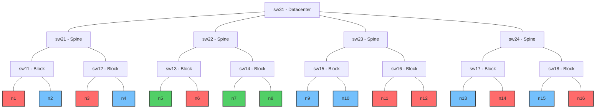
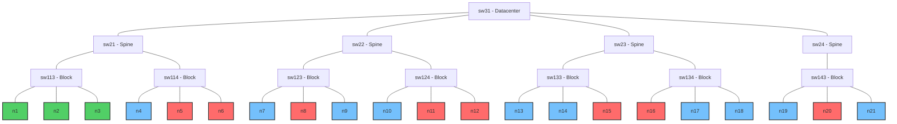
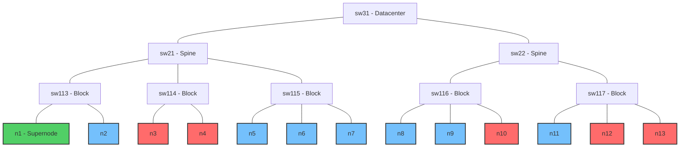

# Benchmarki

Ten katalog zawiera benchmarki dla porównania i oceny wydajności następujących systemów zarządzania obciążeniem i schedulerów:

- Kueue
- Volcano
- YuniKorn

Benchmarki te służą do oceny różnych aspektów wydajności schedulerów pod kątem przepustowości, skalowalności, świadomości topologii sieci oraz sprawiedliwego podziału zasobów.

## Wydajność i Skalowalność (Performance & Scalability)

Benchmarki wydajności dostarczają kompleksowej oceny framework'ów schedulerów w różnych wzorcach obciążeń, mierząc przepustowość, skalowalność i efektywność wykorzystania zasobów. Testy te symulują różne scenariusze, które mogą wystąpić w rzeczywistych środowiskach produkcyjnych.

### V1: Duża liczba identycznych, niezależnych jobów

Benchmark testuje zdolność schedulera do obsługi dużej liczby identycznych, niezależnych zadań. Mierzy wydajność i skalowalność schedulera i efektywność w obsłudze wielu małych zadań.

#### Konfiguracje

Benchmark zawiera wiele konfiguracji z różnymi kombinacjami liczby węzłów i zadań:

##### Liczba jobów: 300

- **300 węzłów**: Test 300 jobów na 300 węzłach
- **400 węzłów**: Test 300 jobów na 400 węzłach
- **500 węzłów**: Test 300 jobów na 500 węzłach

##### Liczba jobów: 400

- **300 węzłów**: Test 400 jobów na 300 węzłach
- **400 węzłów**: Test 400 jobów na 400 węzłach
- **500 węzłów**: Test 400 jobów na 500 węzłach

##### Liczba jobów: 500

- **300 węzłów**: Test 500 jobów na 300 węzłach
- **400 węzłów**: Test 500 jobów na 400 węzłach
- **500 węzłów**: Test 500 jobów na 500 węzłach

Każda konfiguracja testu wykorzystuje:

- Wirtualne węzły, każdy z 128 rdzeniami CPU, 1Ti pamięci i 8 GPU
- Niezależne joby, gdzie każdy składa się z pojedynczego poda o wymaganiach:
  - 16 rdzeni CPU (12,5% węzła)
  - 256Gi pamięci (25% węzła)
  - 4 GPU (50% węzła)

Wykorzystanie zasobów klastra różni się w zależności od konfiguracji:

| Konfiguracja | Wykorzystanie CPU | Wykorzystanie pamięci | Wykorzystanie GPU |
|---------------|-----------|-------------|-----------|
| 300 jobów, 300 węzłów | 12,5% | 25% | 50% |
| 300 jobów, 400 węzłów | 9,38% | 18,75% | 37,5% |
| 300 jobów, 500 węzłów | 7,5% | 15% | 30% |
| 400 jobów, 300 węzłów | 16,67% | 33,33% | 66,67% |
| 400 jobów, 400 węzłów | 12,5% | 25% | 50% |
| 400 jobów, 500 węzłów | 10% | 20% | 40% |
| 500 jobów, 300 węzłów | 20,83% | 41,67% | 83,33% |
| 500 jobów, 400 węzłów | 15,63% | 31,25% | 62,5% |
| 500 jobów, 500 węzłów | 12,5% | 25% | 50% |

**Skrypty do uruchomienia**:

```bash
# Dla Kueue
./bin/knavigator -workflow "resources/benchmarks/performance/workflows/kueue-v1-300-300.yaml"
./bin/knavigator -workflow "resources/benchmarks/performance/workflows/kueue-v1-300-400.yaml"
./bin/knavigator -workflow "resources/benchmarks/performance/workflows/kueue-v1-300-500.yaml"
./bin/knavigator -workflow "resources/benchmarks/performance/workflows/kueue-v1-400-300.yaml"
./bin/knavigator -workflow "resources/benchmarks/performance/workflows/kueue-v1-400-400.yaml"
./bin/knavigator -workflow "resources/benchmarks/performance/workflows/kueue-v1-400-500.yaml"
./bin/knavigator -workflow "resources/benchmarks/performance/workflows/kueue-v1-500-300.yaml"
./bin/knavigator -workflow "resources/benchmarks/performance/workflows/kueue-v1-500-400.yaml"
./bin/knavigator -workflow "resources/benchmarks/performance/workflows/kueue-v1-500-500.yaml"

# Dla Volcano
./bin/knavigator -workflow "resources/benchmarks/performance/workflows/volcano-v1-300-300.yaml"
./bin/knavigator -workflow "resources/benchmarks/performance/workflows/volcano-v1-300-400.yaml"
./bin/knavigator -workflow "resources/benchmarks/performance/workflows/volcano-v1-300-500.yaml"
./bin/knavigator -workflow "resources/benchmarks/performance/workflows/volcano-v1-400-300.yaml"
./bin/knavigator -workflow "resources/benchmarks/performance/workflows/volcano-v1-400-400.yaml"
./bin/knavigator -workflow "resources/benchmarks/performance/workflows/volcano-v1-400-500.yaml"
./bin/knavigator -workflow "resources/benchmarks/performance/workflows/volcano-v1-500-300.yaml"
./bin/knavigator -workflow "resources/benchmarks/performance/workflows/volcano-v1-500-400.yaml"
./bin/knavigator -workflow "resources/benchmarks/performance/workflows/volcano-v1-500-500.yaml"

# Dla YuniKorn
./bin/knavigator -workflow "resources/benchmarks/performance/workflows/yunikorn-v1-300-300.yaml"
./bin/knavigator -workflow "resources/benchmarks/performance/workflows/yunikorn-v1-300-400.yaml"
./bin/knavigator -workflow "resources/benchmarks/performance/workflows/yunikorn-v1-300-500.yaml"
./bin/knavigator -workflow "resources/benchmarks/performance/workflows/yunikorn-v1-400-300.yaml"
./bin/knavigator -workflow "resources/benchmarks/performance/workflows/yunikorn-v1-400-400.yaml"
./bin/knavigator -workflow "resources/benchmarks/performance/workflows/yunikorn-v1-400-500.yaml"
./bin/knavigator -workflow "resources/benchmarks/performance/workflows/yunikorn-v1-500-300.yaml"
./bin/knavigator -workflow "resources/benchmarks/performance/workflows/yunikorn-v1-500-400.yaml"
./bin/knavigator -workflow "resources/benchmarks/performance/workflows/yunikorn-v1-500-500.yaml"
```

### V2: Jeden duży wielopodowy job

Benchmark testuje efektywność schedulera w obsłudze zadań składających się z wielu podów. Ocenia, jak dobrze scheduler radzi sobie z dużym, spójnym obciążeniem.

#### Konfiguracje

Benchmark zawiera wiele konfiguracji z różnymi kombinacjami liczby węzłów i podów w zadaniu:

##### Liczba replik: 300

- **300 węzłów**: Test 1 joba z 300 replikami na 300 węzłach
- **400 węzłów**: Test 1 joba z 300 replikami na 400 węzłach
- **500 węzłów**: Test 1 joba z 300 replikami na 500 węzłach

##### Liczba replik: 400

- **300 węzłów**: Test 1 joba z 400 replikami na 300 węzłach
- **400 węzłów**: Test 1 joba z 400 replikami na 400 węzłach
- **500 węzłów**: Test 1 joba z 400 replikami na 500 węzłach

##### Liczba replik: 500

- **300 węzłów**: Test 1 joba z 500 replikami na 300 węzłach
- **400 węzłów**: Test 1 joba z 500 replikami na 400 węzłach
- **500 węzłów**: Test 1 joba z 500 replikami na 500 węzłach

Każda konfiguracja testu wykorzystuje:

- Wirtualne węzły, każdy z 128 rdzeniami CPU, 1Ti pamięci i 8 GPU
- Jeden wielopodowy job, gdzie każdy pod ma wymagania:
  - 16 rdzeni CPU (12,5% węzła)
  - 256Gi pamięci (25% węzła)
  - 4 GPU (50% węzła)

Wykorzystanie zasobów klastra różni się w zależności od konfiguracji:

| Konfiguracja | Wykorzystanie CPU | Wykorzystanie pamięci | Wykorzystanie GPU |
|---------------|-----------|-------------|-----------|
| 300 replik, 300 węzłów | 12,5% | 25% | 50% |
| 300 replik, 400 węzłów | 9,38% | 18,75% | 37,5% |
| 300 replik, 500 węzłów | 7,5% | 15% | 30% |
| 400 replik, 300 węzłów | 16,67% | 33,33% | 66,67% |
| 400 replik, 400 węzłów | 12,5% | 25% | 50% |
| 400 replik, 500 węzłów | 10% | 20% | 40% |
| 500 replik, 300 węzłów | 20,83% | 41,67% | 83,33% |
| 500 replik, 400 węzłów | 15,63% | 31,25% | 62,5% |
| 500 replik, 500 węzłów | 12,5% | 25% | 50% |

**Skrypty do uruchomienia**:

```bash
# Dla Kueue
./bin/knavigator -workflow "resources/benchmarks/performance/workflows/v2/kueue-v2-300-300.yaml"
./bin/knavigator -workflow "resources/benchmarks/performance/workflows/v2/kueue-v2-300-400.yaml"
./bin/knavigator -workflow "resources/benchmarks/performance/workflows/v2/kueue-v2-300-500.yaml"
./bin/knavigator -workflow "resources/benchmarks/performance/workflows/v2/kueue-v2-400-300.yaml"
./bin/knavigator -workflow "resources/benchmarks/performance/workflows/v2/kueue-v2-400-400.yaml"
./bin/knavigator -workflow "resources/benchmarks/performance/workflows/v2/kueue-v2-400-500.yaml"
./bin/knavigator -workflow "resources/benchmarks/performance/workflows/v2/kueue-v2-500-300.yaml"
./bin/knavigator -workflow "resources/benchmarks/performance/workflows/v2/kueue-v2-500-400.yaml"
./bin/knavigator -workflow "resources/benchmarks/performance/workflows/v2/kueue-v2-500-500.yaml"

# Dla Volcano
./bin/knavigator -workflow "resources/benchmarks/performance/workflows/v2/volcano-v2-300-300.yaml"
./bin/knavigator -workflow "resources/benchmarks/performance/workflows/v2/volcano-v2-300-400.yaml"
./bin/knavigator -workflow "resources/benchmarks/performance/workflows/v2/volcano-v2-300-500.yaml"
./bin/knavigator -workflow "resources/benchmarks/performance/workflows/v2/volcano-v2-400-300.yaml"
./bin/knavigator -workflow "resources/benchmarks/performance/workflows/v2/volcano-v2-400-400.yaml"
./bin/knavigator -workflow "resources/benchmarks/performance/workflows/v2/volcano-v2-400-500.yaml"
./bin/knavigator -workflow "resources/benchmarks/performance/workflows/v2/volcano-v2-500-300.yaml"
./bin/knavigator -workflow "resources/benchmarks/performance/workflows/v2/volcano-v2-500-400.yaml"
./bin/knavigator -workflow "resources/benchmarks/performance/workflows/v2/volcano-v2-500-500.yaml"

# Dla YuniKorn
./bin/knavigator -workflow "resources/benchmarks/performance/workflows/v2/yunikorn-v2-300-300.yaml"
./bin/knavigator -workflow "resources/benchmarks/performance/workflows/v2/yunikorn-v2-300-400.yaml"
./bin/knavigator -workflow "resources/benchmarks/performance/workflows/v2/yunikorn-v2-300-500.yaml"
./bin/knavigator -workflow "resources/benchmarks/performance/workflows/v2/yunikorn-v2-400-300.yaml"
./bin/knavigator -workflow "resources/benchmarks/performance/workflows/v2/yunikorn-v2-400-400.yaml"
./bin/knavigator -workflow "resources/benchmarks/performance/workflows/v2/yunikorn-v2-400-500.yaml"
./bin/knavigator -workflow "resources/benchmarks/performance/workflows/v2/yunikorn-v2-500-300.yaml"
./bin/knavigator -workflow "resources/benchmarks/performance/workflows/v2/yunikorn-v2-500-400.yaml"
./bin/knavigator -workflow "resources/benchmarks/performance/workflows/v2/yunikorn-v2-500-500.yaml"
```

### V3: Mieszane stopniowe obciążenie

Benchmark testuje wydajność schedulera z różnorodnymi obciążeniami, które lepiej reprezentują rzeczywiste wzorce użytkowania klastra. Ocenia, jak dobrze scheduler radzi sobie z heterogenicznymi typami zadań o różnych wymaganiach zasobowych jednocześnie.

#### Konfiguracje

Benchmark zawiera wiele konfiguracji z różnymi kombinacjami liczby węzłów i liczby zadań:

##### Liczba zadań każdego typu: 100 (łącznie 300 zadań)

- **300 węzłów**: Test z 300 węzłami i 100 zadaniami każdego typu
- **400 węzłów**: Test z 400 węzłami i 100 zadaniami każdego typu
- **500 węzłów**: Test z 500 węzłami i 100 zadaniami każdego typu

##### Liczba zadań każdego typu: 200 (łącznie 600 zadań)

- **300 węzłów**: Test z 300 węzłami i 200 zadaniami każdego typu
- **400 węzłów**: Test z 400 węzłami i 200 zadaniami każdego typu
- **500 węzłów**: Test z 500 węzłami i 200 zadaniami każdego typu

##### Liczba zadań każdego typu: 300 (łącznie 900 zadań)

- **300 węzłów**: Test z 300 węzłami i 300 zadaniami każdego typu
- **400 węzłów**: Test z 400 węzłami i 300 zadaniami każdego typu
- **500 węzłów**: Test z 500 węzłami i 300 zadaniami każdego typu

Każda konfiguracja testu wykorzystuje:

- Wirtualne węzły, każdy z 128 rdzeniami CPU, 1Ti pamięci i 8 GPU
- Trzy różne typy zadań uruchamiane równolegle:

  - **Zadania o wysokim użyciu GPU**: Zadania wykorzystujące całe węzły GPU (8 GPU na job)

    - 16 rdzeni CPU (12.5% węzła)
    - 96Gi pamięci (9.4% węzła)
    - 8 GPU (100% węzła)

  - **Zadania o średnim użyciu GPU**: Zadania z częściowym wykorzystaniem GPU (2 GPU na job)

    - 8 rdzeni CPU (6.25% węzła)
    - 32Gi pamięci (3.1% węzła)
    - 2 GPU (25% węzła)

  - **Zadania CPU-only**: Zadania bez wymagań GPU

    - 32 rdzenie CPU (25% węzła)
    - 128Gi pamięci (12.5% węzła)
    - 0 GPU

Wykorzystanie zasobów klastra różni się w zależności od konfiguracji:

| Konfiguracja węzłów | Liczba zadań | Całkowite wykorzystanie CPU | Całkowite wykorzystanie pamięci | Całkowite wykorzystanie GPU |
|-----------|-----------|-----------|-----------|-----------|
| 300 | 100 każdego typu | 14,58% | 8,33% | 41,67% |
| 300 | 200 każdego typu | 29,17% | 16,67% | 83,33% |
| 300 | 300 każdego typu | 43,75% | 25,00% | 125,00% |
| 400 | 100 każdego typu | 10,94% | 6,25% | 31,25% |
| 400 | 200 każdego typu | 21,88% | 12,50% | 62,50% |
| 400 | 300 każdego typu | 32,81% | 18,75% | 93,75% |
| 500 | 100 każdego typu | 8,75% | 5,00% | 25,00% |
| 500 | 200 każdego typu | 17,50% | 10,00% | 50,00% |
| 500 | 300 każdego typu | 26,25% | 15,00% | 75,00% |

**Skrypty do uruchomienia**:

```bash
# Dla Kueue (100 zadań każdego typu)
./bin/knavigator -workflow "resources/benchmarks/performance/workflows/v3/kueue-v3-300-100.yaml"
./bin/knavigator -workflow "resources/benchmarks/performance/workflows/v3/kueue-v3-400-100.yaml"
./bin/knavigator -workflow "resources/benchmarks/performance/workflows/v3/kueue-v3-500-100.yaml"

# Dla Kueue (200 zadań każdego typu)
./bin/knavigator -workflow "resources/benchmarks/performance/workflows/v3/kueue-v3-300-200.yaml"
./bin/knavigator -workflow "resources/benchmarks/performance/workflows/v3/kueue-v3-400-200.yaml"
./bin/knavigator -workflow "resources/benchmarks/performance/workflows/v3/kueue-v3-500-200.yaml"

# Dla Kueue (300 zadań każdego typu)
./bin/knavigator -workflow "resources/benchmarks/performance/workflows/v3/kueue-v3-300-300.yaml"
./bin/knavigator -workflow "resources/benchmarks/performance/workflows/v3/kueue-v3-400-300.yaml"
./bin/knavigator -workflow "resources/benchmarks/performance/workflows/v3/kueue-v3-500-300.yaml"

# Dla Volcano (100 zadań każdego typu)
./bin/knavigator -workflow "resources/benchmarks/performance/workflows/v3/volcano-v3-300-100.yaml"
./bin/knavigator -workflow "resources/benchmarks/performance/workflows/v3/volcano-v3-400-100.yaml"
./bin/knavigator -workflow "resources/benchmarks/performance/workflows/v3/volcano-v3-500-100.yaml"

# Dla Volcano (200 zadań każdego typu)
./bin/knavigator -workflow "resources/benchmarks/performance/workflows/v3/volcano-v3-300-200.yaml"
./bin/knavigator -workflow "resources/benchmarks/performance/workflows/v3/volcano-v3-400-200.yaml"
./bin/knavigator -workflow "resources/benchmarks/performance/workflows/v3/volcano-v3-500-200.yaml"

# Dla Volcano (300 zadań każdego typu)
./bin/knavigator -workflow "resources/benchmarks/performance/workflows/v3/volcano-v3-300-300.yaml"
./bin/knavigator -workflow "resources/benchmarks/performance/workflows/v3/volcano-v3-400-300.yaml"
./bin/knavigator -workflow "resources/benchmarks/performance/workflows/v3/volcano-v3-500-300.yaml"

# Dla YuniKorn (100 zadań każdego typu)
./bin/knavigator -workflow "resources/benchmarks/performance/workflows/v3/yunikorn-v3-300-100.yaml"
./bin/knavigator -workflow "resources/benchmarks/performance/workflows/v3/yunikorn-v3-400-100.yaml"
./bin/knavigator -workflow "resources/benchmarks/performance/workflows/v3/yunikorn-v3-500-100.yaml"

# Dla YuniKorn (200 zadań każdego typu)
./bin/knavigator -workflow "resources/benchmarks/performance/workflows/v3/yunikorn-v3-300-200.yaml"
./bin/knavigator -workflow "resources/benchmarks/performance/workflows/v3/yunikorn-v3-400-200.yaml"
./bin/knavigator -workflow "resources/benchmarks/performance/workflows/v3/yunikorn-v3-500-200.yaml"

# Dla YuniKorn (300 zadań każdego typu)
./bin/knavigator -workflow "resources/benchmarks/performance/workflows/v3/yunikorn-v3-300-300.yaml"
./bin/knavigator -workflow "resources/benchmarks/performance/workflows/v3/yunikorn-v3-400-300.yaml"
./bin/knavigator -workflow "resources/benchmarks/performance/workflows/v3/yunikorn-v3-500-300.yaml"
```

## Świadomość topologii klastra (Topology Awareness)

Benchmark Topology Aware ocenia zdolność schedulera do inteligentnego rozmieszczania podów w oparciu o topologię sieci. Ta funkcjonalność jest kluczowa dla rozproszonych obciążeń, takich jak trening deep learning, gdzie opóźnienie komunikacji między podami może znacząco wpływać na wydajność.

Testy tworzą symulowaną topologię sieci z różnymi warstwami (datacenter, spine, block) i sprawdzają, jak dobrze scheduler potrafi umieszczać pody, aby zminimalizować odległości sieciowe między współpracującymi podami.

Benchmarki są zaimplementowane dla Kueue i Volcano, ponieważ YuniKorn nie wspiera obecnie planowania opartego na topologii sieci.

### V1: Planowanie na 2 poziomie hierarchii (spine)

Test konfiguruje 16 węzłów w układzie drzewiastym reprezentującym topologię sieci:



Na tym diagramie:

- Węzły n1, n3, n6, n11, n12, n14 i n16 są oznaczone jako nieplanowalne (X)
- Węzły n5, n7 i n8 są oznaczone jako "optymalne" ze względu na topologię sieci (pod sw22)

**Test**:

- **Konfiguracja węzłów**: Test tworzy 16 wirtualnych węzłów z etykietami topologii sieci na różnych poziomach:

  - network.topology.kubernetes.io/datacenter: Segment sieci najwyższego poziomu
  - network.topology.kubernetes.io/spine: Segment sieci średniego poziomu
  - network.topology.kubernetes.io/block: Segment sieci najniższego poziomu

- **Obciążenie: Test przeprowadza dwie fazy**:

  - Uruchamia job z 3 podami używając strategii *"required" (Kueue) / "hard" (Volcano)* na poziomie spine
  - Uruchamia ten sam job z 3 podami używając strategii *"preferred" (Kueue) / "soft" (Volcano)* na poziomie spine

- **Ocena**: Sukces jest mierzony zdolnością schedulera do umieszczenia wszystkich podów na optymalnych węzłach (n5, n7, n8), które zostały oznaczone etykietą "ta-optimal: true" i mają najmniejszą odległość sieciową między sobą.

**Skrypty do uruchomienia**:

```sh
# Dla Kueue
./bin/knavigator -workflow 'resources/benchmarks/topology-aware/workflows/kueue-v1.yaml'

# Dla Volcano
./bin/knavigator -workflow 'resources/benchmarks/topology-aware/workflows/volcano-v1.yaml'
```

### V2: Planowanie na 1 poziomie hierarchii (block)

Benchmark konfiguruje 21 węzłów w bardziej złożonym układzie drzewiastym:



Na tym diagramie:

- Węzły n5, n6, n8, n11, n12, n15, n16 i n20 są oznaczone jako nieplanowalne (X)
- Węzły n1, n2 i n3 znajdują się w tym samym bloku sieci (sw113) i są oznaczone jako "optymalne"

**Test**:

- **Konfiguracja węzłów**: Podobna do V1, ale z inną strukturą topologii, gdzie optymalne węzły znajdują się wszystkie w tym samym bloku sieci, zapewniając najmniejsze możliwe opóźnienie dla komunikacji między podami.

- **Obciążenie**: Test przeprowadza dwie sekwencyjne próby planowania na poziomie bloku (network.topology.kubernetes.io/block):

  - Job z 3 podami używający strategii *"required" (Kueue) /"hard" (Volcano)* (twarde ograniczenie, które musi być spełnione do zaplanowania)

  - Job z 3 podami używający strategii *"preferred" (Kueue) /"soft" (Volcano)* (miękkie ograniczenie, które scheduler powinien starać się spełnić)

- **Ocena**: Sukces jest mierzony przez zdolność schedulera do umieszczenia wszystkich podów na optymalnych węzłach (n1, n2, n3) dla obu trybów planowania. Test sprawdza zarówno zdolność schedulera do honorowania preferencji topologii, gdy jest to możliwe, jak i do egzekwowania ścisłych wymagań topologicznych, gdy jest to konieczne.

**Skrypty do uruchomienia**:

```sh
# Dla Kueue
./bin/knavigator -workflow 'resources/benchmarks/topology-aware/workflows/kueue-v2.yaml'

# Dla Volcano
./bin/knavigator -workflow 'resources/benchmarks/topology-aware/workflows/volcano-v2.yaml'
```

### V3: Planowanie na 0 poziomie hierarchii (node)

Benchmark konfiguruje 13 węzłów z topologią sieci, która zawiera "superwęzeł" o wysokiej pojemności oraz wiele zwykłych węzłów:



Na tym diagramie:

- Węzeł n1 to "superwęzeł" o wysokiej pojemności (24 GPU, 256 rdzeni CPU), zdolny do hostowania wszystkich podów zasobochłonnego joba
- Zwykłe węzły mają standardową pojemność (8 GPU, 128 rdzeni CPU)
- Węzły n3, n4, n10, n12 i n13 są oznaczone jako nieplanowalne (X)
- Blok sw116 ma 2 dostępne węzły (n8, n9) i 1 niedostępny (n10)
- Blok sw117 ma 1 dostępny węzeł (n11) i 2 niedostępne (n12, n13)
- Wszystkie węzły w bloku sw115 (n5, n6, n7) są dostępne do planowania

**Test**:

- **Faza 1 - Umieszczanie na pojedynczym węźle**:

  - Test tworzy job z 3 podami, każdy wymagający 6 GPU (łącznie 18 GPU) z preferencją topologii na poziomie węzła używający strategii *"required" (Kueue) /"hard" (Volcano)* (twarde ograniczenie, które musi być spełnione do zaplanowania)
  - Wszystkie pody powinny być zaplanowane na superwęźle (n1)
  - Test sprawdza zdolność schedulera do konsolidacji podów na pojedynczym węźle, gdy zasoby na to pozwalają i preferencje topologii to sugerują
  - Zwykłe węzły (8 GPU każdy) wymagałyby wielu węzłów do spełnienia żądania

- **Faza 2 - Dystrybucja na wielu węzłach**:

  - Superwęzeł zostaje oznaczony jako nieplanowany
  - Nowy job z identycznymi wymaganiami zasobowymi jest uruchamiany z preferencją topologii na poziomie węzła używający strategii *"preferred" (Kueue) /"soft" (Volcano)* (miękkie ograniczenie, które scheduler powinien starać się spełnić)
  - Ponieważ niemożliwe jest umieszczenie na jednym węźle, pody powinny być teraz rozłożone na dostępnych węzłach w bloku sw115, bo jest to drugi najniższy, możliwy poziom hierarchii, na którym zmieszą się wszystkie pody joba.
  - Test sprawdza zdolność schedulera do dystrybucji podów na wielu węzłach, zachowując je w tym samym bloku sieciowym, gdy pojedynczy węzeł nie jest dostępny

- **Ocena**:

  - Sukces jest mierzony zdolnością schedulera do prawidłowego umieszczenia wszystkich podów na superwęźle w fazie 1
  - I zdolnością do dystrybucji podów na wielu węzłach w tym samym bloku w fazie 2

**Skrypty do uruchomienia**:

```sh
# Dla Kueue
./bin/knavigator -workflow 'resources/benchmarks/topology-aware/workflows/kueue-v3.yaml'

# Dla Volcano
./bin/knavigator -workflow 'resources/benchmarks/topology-aware/workflows/volcano-v3.yaml'
```

## Sprawiedliwy przydział zasobów (Fair Share)

Benchmarki w tej sekcji oceniają zdolność schedulerów do sprawiedliwego podziału zasobów klastra między różnymi grupami użytkowników (najemcami) lub kolejkami zadań. Testują one różne aspekty mechanizmów *fair share*, w tym:

1. **Równy podział** przy identycznych wymaganiach i wagach (V1).
2. **Proporcjonalny podział** na podstawie zdefiniowanych wag (V2).
3. **Dominant Resource Fairness (DRF)** w środowisku z wieloma typami zasobów i różnorodnymi wymaganiami zadań (V3).

Każdy scenariusz jest testowany w dwóch wariantach: bez gwarancji zasobów (aby obserwować "czysty" mechanizm fair share) oraz z gwarancjami (aby zbadać interakcję fair share z gwarantowanymi kwotami i potencjalnym wpływem na preempcję).

### V1: Równy podział przy identycznych wagach (Homogeniczny Klaster)

**Opis**: Sprawdza, czy scheduler prawidłowo implementuje podstawowy mechanizm sprawiedliwego podziału zasobów między najemcami (tenants) o **identycznych wagach**, uruchamiającymi **identyczne zadania** w **homogenicznym** klastrze. Test ten stanowi bazę przed bardziej złożonymi scenariuszami.

**Konfiguracja**:

- Klaster z 5 identycznymi węzłami, każdy z ~15 CPU i ~15 GB RAM do dyspozycji.
- Łączne zasoby klastra: **75 CPU** i **~75 GB RAM**.
- Trzej najemcy (tenant-a, tenant-b, tenant-c) z **równymi wagami** (weight=1 lub domyślna równa waga).
- Każde zadanie wymaga identycznych zasobów: **<1 CPU, 1 GB RAM>**.
- Mechanizmy fair-share skonfigurowane odpowiednio dla każdego schedulera.
- **Dwa warianty testu:**
    1. **Bez Gwarancji (`*-v1-no-guarantees.yaml`):** Gwarantowane zasoby (`guarantee`/`nominalQuota`) ustawione na 0, aby obserwować "czysty" efekt fair sharing sterowany tylko dostępnością zasobów i równymi uprawnieniami.
    2. **Z Gwarancjami (`*-v1-guarantees.yaml`):** Każdemu najemcy gwarantowane jest 1/3 zasobów klastra (25 CPU, 25 GB RAM), aby obserwować interakcję fair sharing z gwarancjami (np. potencjalny wpływ na preempcję, gdy kolejka spadnie poniżej gwarancji).

**Działanie**:

- Zadania przesyłane są sekwencyjnie w trzech rundach z opóźnieniami:
  - Runda 1: 30 zadań / najemcę
  - Runda 2: 25 zadań / najemcę
  - Runda 3: 20 zadań / najemcę
- Łącznie 75 zadań / najemcę, 225 zadań w sumie.
- Całkowite zapotrzebowanie (225 CPU, 225 GB RAM) znacznie przekracza pojemność klastra (75 CPU, 75 GB RAM), wymuszając działanie mechanizmów fair sharing.

**Oczekiwany wynik**:

- Niezależnie od wariantu (z gwarancjami czy bez), w stanie nasycenia klastera, mechanizm fair-sharing powinien zapewnić **równy podział dostępnych zasobów** (zarówno CPU, jak i RAM) między trzech najemców.
- Każdy najemca powinien otrzymać około **1/3 zasobów klastra**, czyli:
  - **~25 CPU**
  - **~25 GB RAM**
- Biorąc pod uwagę, że każde zadanie wymaga 1 CPU i 1 GB RAM, dla każdego najemcy powinno zostać **uruchomionych około 25 zadań**.
- Pozostałe zadania (50 na najemcę) powinny oczekiwać w kolejce.
- W wariancie "z gwarancjami", gwarancje mogą wpłynąć na dynamikę osiągania stanu równowagi lub zachowanie preempcji, ale ostateczny, stabilny podział zasobów powinien być taki sam (1/3 dla każdego).

**Skrypty do uruchomienia**:

- **Wariant BEZ Gwarancji:**

    ```sh
    # Dla Kueue
    ./bin/knavigator -workflow 'resources/benchmarks/fair-share/workflows/kueue-v1-no-guarantees.yaml'
    # Dla Volcano
    ./bin/knavigator -workflow 'resources/benchmarks/fair-share/workflows/volcano-v1-no-guarantees.yaml'
    # Dla YuniKorn
    ./bin/knavigator -workflow 'resources/benchmarks/fair-share/workflows/yunikorn-v1-no-guarantees.yaml'
    ```

- **Wariant Z Gwarancjami:**

    ```sh
    # Dla Kueue
    ./bin/knavigator -workflow 'resources/benchmarks/fair-share/workflows/kueue-v1-guarantees.yaml'
    # Dla Volcano
    ./bin/knavigator -workflow 'resources/benchmarks/fair-share/workflows/volcano-v1-guarantees.yaml'
    # Dla YuniKorn
    ./bin/knavigator -workflow 'resources/benchmarks/fair-share/workflows/yunikorn-v1-guarantees.yaml'
    ```

### V2: Proporcjonalny podział przy różnych wagach (Homogeniczny Klaster)

**Opis**: Weryfikuje, czy scheduler prawidłowo implementuje **proporcjonalny podział zasobów** na podstawie **różnych wag** przypisanych najemcom w **homogenicznym** klastrze, gdy zadania mają identyczne wymagania.

**Konfiguracja**:

- Klaster z 6 identycznymi węzłami, każdy z ~16 CPU i ~16 GB RAM do dyspozycji.
- Łączne zasoby klastra: **96 CPU** i **~96 GB RAM**.
- Trzej najemcy (tenant-a, tenant-b, tenant-c) z różnymi wagami (konfigurowanymi odpowiednio dla danego schedulera):
  - **Tenant A: waga 3**
  - **Tenant B: waga 2**
  - **Tenant C: waga 1**
  - (Łączna liczba jednostek wagi: 3 + 2 + 1 = 6)
- Każde zadanie wymaga identycznych zasobów: **<1 CPU, 1 GiB RAM>**.
- Mechanizmy fair-share skonfigurowane odpowiednio dla każdego schedulera (z uwzględnieniem wag).
- **Dwa warianty testu:**
    1. **Bez Gwarancji (`*-v2-no-guarantees.yaml`):** Gwarantowane zasoby (`guarantee`/`nominalQuota`) ustawione na 0 (lub minimalną wartość wymaganą przez Kueue z użyciem `dummy-queue`). Podział zasobów powinien być sterowany wyłącznie przez wagi i dostępność zasobów.
    2. **Z Gwarancjami (`*-v2-guarantees.yaml`):** Gwarantowane zasoby ustawione proporcjonalnie do wag (A: 48 CPU/48GB, B: 32 CPU/32GB, C: 16 CPU/16GB). Obserwujemy interakcję mechanizmu ważonego podziału z gwarancjami.

**Działanie**:

- Zadania przesyłane są sekwencyjnie w trzech rundach z opóźnieniami: **10 sekund między najemcami** w ramach rundy i **10 sekund między rundami**.
  - **Runda 1**: 50 zadań / najemcę (łącznie 150 zadań)
  - **Runda 2**: 30 zadań / najemcę (łącznie 90 zadań)
  - **Runda 3**: 10 zadań / najemcę (łącznie 30 zadań)
- Łącznie **90 zadań / najemcę**, **270 zadań w sumie**.
- Całkowite zapotrzebowanie (**270 CPU, 270 GiB RAM**) znacznie przekracza pojemność klastra (96 CPU, 96 GB RAM), wymuszając działanie mechanizmów fair sharing.

**Oczekiwany wynik**:

- Niezależnie od wariantu (z gwarancjami czy bez), w stanie nasycenia klastera, mechanizm fair-sharing (uwzględniający wagi) powinien zapewnić **podział dostępnych zasobów proporcjonalnie do wag 3:2:1**.
- Oczekiwana alokacja zasobów dla każdego najemcy:
  - **Tenant A (waga 3):** (3/6) *96 CPU = **48 CPU**; (3/6)* 96 GB = **48 GB RAM**
  - **Tenant B (waga 2):** (2/6) *96 CPU = **32 CPU**; (2/6)* 96 GB = **32 GB RAM**
  - **Tenant C (waga 1):** (1/6) *96 CPU = **16 CPU**; (1/6)* 96 GB = **16 GB RAM**
- Biorąc pod uwagę zadania <1 CPU, 1 GiB RAM>, oczekiwana liczba **uruchomionych zadań** w stanie równowagi:
  - **Tenant A: ~48 zadań**
  - **Tenant B: ~32 zadania**
  - **Tenant C: ~16 zadań**
- Pozostałe zadania (A: 90-48=42, B: 90-32=58, C: 90-16=74) powinny oczekiwać w kolejce. *(Uwaga: te liczby oczekujących zadań są teraz wyższe ze względu na większą liczbę wysłanych zadań)*.
- W wariancie "z gwarancjami", gwarancje ustawione zgodnie z oczekiwanym podziałem wagowym mogą ustabilizować alokację i wpłynąć na preempcję, ale ostateczny podział zasobów powinien być zgodny ze stosunkiem wag 3:2:1 (choć jak zaobserwowano w Kueue, interakcja może być złożona).

**Skrypty do uruchomienia**:

- **Wariant BEZ Gwarancji:**

    ```sh
    # Dla Kueue
    ./bin/knavigator -workflow 'resources/benchmarks/fair-share/workflows/kueue-v2-no-guarantees.yaml'
    # Dla Volcano
    ./bin/knavigator -workflow 'resources/benchmarks/fair-share/workflows/volcano-v2-no-guarantees.yaml'
    # Dla YuniKorn
    ./bin/knavigator -workflow 'resources/benchmarks/fair-share/workflows/yunikorn-v2-no-guarantees.yaml'
    ```

- **Wariant Z Gwarancjami:**

    ```sh
    # Dla Kueue
    ./bin/knavigator -workflow 'resources/benchmarks/fair-share/workflows/kueue-v2-guarantees.yaml'
    # Dla Volcano
    ./bin/knavigator -workflow 'resources/benchmarks/fair-share/workflows/volcano-v2-guarantees.yaml'
    # Dla YuniKorn
    ./bin/knavigator -workflow 'resources/benchmarks/fair-share/workflows/yunikorn-v2-guarantees.yaml'
    ```

### V3: Heterogeniczna sprawiedliwość

**Opis**: Weryfikuje implementację algorytmu **Dominant Resource Fairness (DRF)** w środowisku **heterogenicznym**. Test sprawdza, jak scheduler rozdziela zasoby (CPU, RAM, GPU) między najemców o **różnych profilach zapotrzebowania** i równych wagach, dążąc do wyrównania ich dominujących udziałów w zasobach całego klastra.

**Konfiguracja**:

- Klaster z 12 węzłami podzielonymi na 3 typy, zapewniający różnorodność zasobów:
  - **Typ A**: 4 węzły CPU-intensive (~64 CPU, ~64 GiB RAM, 0 GPU każdy)
  - **Typ B**: 4 węzły RAM-intensive (~16 CPU, ~256 GiB RAM, 0 GPU każdy)
  - **Typ C**: 4 węzły GPU-enabled (~16 CPU, ~64 GiB RAM, 4 GPU każdy)
- Całkowite zasoby klastra: **~384 CPU, ~1536 GiB RAM, 16 GPU**.
- Trzej najemcy (tenant-a, tenant-b, tenant-c) z **równymi wagami** (weight=1 lub domyślnie), ale różnymi profilami zadań:
  - **Tenant A (CPU-heavy)**: Zadania `<4 CPU, 4 GiB RAM, 0 GPU>` (Dominujący zasób: CPU)
  - **Tenant B (Memory-heavy)**: Zadania `<1 CPU, 16 GiB RAM, 0 GPU>` (Dominujący zasób: RAM)
  - **Tenant C (GPU-heavy)**: Zadania `<1 CPU, 4 GiB RAM, 1 GPU>` (Dominujący zasób: GPU)
- Mechanizmy fair share/DRF skonfigurowane odpowiednio dla każdego schedulera.
- **Dwa warianty testu:**
    1. **Bez Gwarancji (`*-v3-no-guarantees.yaml`):** Gwarantowane/minimalne zasoby (`guarantee`/`nominalQuota`) ustawione na 0 (lub minimalną wartość/z użyciem dummy-queue dla Kueue). Celem jest obserwacja "czystego" algorytmu DRF, gdzie podział sterowany jest głównie dostępnością zasobów i dążeniem do wyrównania dominujących udziałów.
    2. **Z Gwarancjami (`*-v3-guarantees.yaml`):** Gwarantowane zasoby ustawione na poziomie ~1/3 dominującego zasobu dla każdego najemcy (A: 128 CPU/128GiB, B: 32 CPU/512GiB, C: 5 CPU/20GiB/5 GPU). Limity pożyczania ustawione na maksimum. Celem jest obserwacja **interakcji** między mechanizmem gwarancji/preempcji `reclaim` a dynamicznym algorytmem DRF działającym na zasobach pożyczonych.

**Działanie**:

- Zadania przesyłane są sekwencyjnie w trzech rundach z opóźnieniami (**10s między najemcami, 30s między rundami**):
  - Runda 1: A: 100, B: 100, C: 50 zadań
  - Runda 2: A: 100, B: 100, C: 50 zadań
  - Runda 3: A: 100, B: 100, C: 50 zadań
- Łącznie: Tenant A: 300, Tenant B: 300, Tenant C: 150 zadań.
- Duża liczba zadań zapewnia nasycenie klastra i wymusza działanie mechanizmów sprawiedliwego podziału.

**Oczekiwany wynik**:

Scheduler powinien przydzielić zasoby zgodnie z zasadami DRF (Dominant Resource Fairness), co oznacza dążenie do **wyrównania całkowitego zużycia dominującego zasobu** przez każdego najemcę, ważonego jego wagą (tutaj wagi są równe 1).

- **Identyfikacja zasobu dominującego i jego udziału (na zadanie):**
  - Całkowite zasoby klastra: `R = <384 CPU, 1536 GB RAM, 16 GPU>`
  - **Tenant A** (Zadanie `<4 CPU, 4 GB RAM, 0 GPU>`):
    - Udziały: CPU `4/384 = 1/96`, RAM `4/1536 = 1/384`, GPU `0/16 = 0`
    - Dominujący zasób: **CPU**. Udział dominujący na zadanie: **1/96**
  - **Tenant B** (Zadanie `<1 CPU, 16 GB RAM, 0 GPU>`):
    - Udziały: CPU `1/384`, RAM `16/1536 = 1/96`, GPU `0/16 = 0`
    - Dominujący zasób: **RAM**. Udział dominujący na zadanie: **1/96**
  - **Tenant C** (Zadanie `<1 CPU, 4 GB RAM, 1 GPU>`):
    - Udziały: CPU `1/384`, RAM `4/1536 = 1/384`, GPU `1/16 = 6/96`
    - Dominujący zasób: **GPU**. Udział dominujący na zadanie: **1/16** (czyli 6 razy większy niż A i B)

- **Oczekiwana relacja liczby zadań przy równym podziale DRF:**
  - Aby całkowite udziały dominujące były równe (`TotalShare_A ≈ TotalShare_B ≈ TotalShare_C`):
    `N_A * (1/96) ≈ N_B * (1/96) ≈ N_C * (6/96)`
  - Oznacza to, że w stanie równowagi oczekujemy relacji liczby uruchomionych zadań:
    `N_A ≈ N_B` oraz `N_A ≈ 6 * N_C` (lub `N_C ≈ N_A / 6`)

- **Obliczenie maksymalnej liczby zadań przy ograniczeniach klastra:**
  - Podstawiając relacje z kroku 2 do ograniczeń zasobów klastra:
    - CPU:

      `4*N_A + 1*N_B + 1*N_C ≤ 384` =>

      `4*N_A + N_A + (N_A/6) ≤ 384` =>

      `5.167 * N_A ≤ 384` =>

      `N_A ≤ ~74`

    - RAM:

      `4*N_A + 16*N_B + 4*N_C ≤ 1536` =>

      `4*N_A + 16*N_A + 4*(N_A/6) ≤ 1536` =>

      `20.667 * N_A ≤ 1536` =>

      `N_A ≤ ~74`

    - GPU:

      `0*N_A + 0*N_B + 1*N_C ≤ 16` =>

      `N_A/6 ≤ 16` =>

      `N_A ≤ 96`

  - Najbardziej restrykcyjnym ograniczeniem jest CPU i RAM, które limitują `N_A` do około 74.

- **Oczekiwana liczba uruchomionych zadań (przy pełnym obciążeniu i działającym DRF):**
  - **Tenant A:** `N_A ≈ 74` zadania (CPU-heavy)
  - **Tenant B:** `N_B ≈ 74` zadania (Memory-heavy)
  - **Tenant C:** `N_C ≈ 12` zadań (GPU-heavy, bo `74 / 6 ≈ 12`)
  - Obserwacja stosunku liczby działających zadań bliskiego **~74 : ~74 : ~12** będzie potwierdzeniem poprawnej implementacji DRF przez scheduler.

- Scheduler powinien efektywnie wykorzystywać dostępne zasoby na odpowiednich typach węzłów (heterogeniczność), jednocześnie dążąc do globalnego zrównoważenia udziałów dominujących zasobów zgodnie z powyższymi obliczeniami. Gwarancje zasobów (jeśli ustawione wysoko) mogą wpływać na początkową alokację lub preempcję, ale w stanie nasycenia klastera podział powinien dążyć do wyniku DRF. W tym teście minimalizujemy wpływ gwarancji, aby obserwować "czysty" efekt DRF.

**Interpretacja Wariantów:**

- **Wariant "Bez Gwarancji":** Oczekujemy, że system będzie swobodnie dążył do jednego z powyższych stanów równowagi DRF, sterowany głównie dostępnością zasobów i algorytmem sprawiedliwości.
- **Wariant "Z Gwarancjami":** Oczekujemy zobaczyć **interakcję**. System może początkowo stabilizować się bliżej gwarancji (np. 32/32/5 dla Kueue z `reclaim: Any`), a następnie, w miarę kończenia się zadań i działania preempcji/pożyczania, **potencjalnie (choć niekoniecznie w pełni)** ewoluować w kierunku stanu równowagi DRF. Porównanie z wariantem "Bez Gwarancji" pokaże, jak gwarancje wpływają na tę dynamikę i ostateczny podział w danym schedulerze.

**Skrypty do uruchomienia**:

- **Wariant BEZ Gwarancji:**

    ```sh
    # Dla Kueue
    ./bin/knavigator -workflow 'resources/benchmarks/fair-share/workflows/kueue-v3-no-guarantees.yaml'
    # Dla Volcano
    ./bin/knavigator -workflow 'resources/benchmarks/fair-share/workflows/volcano-v3-no-guarantees.yaml'
    # Dla YuniKorn
    ./bin/knavigator -workflow 'resources/benchmarks/fair-share/workflows/yunikorn-v3-no-guarantees.yaml'
    ```

- **Wariant Z Gwarancjami:**

    ```sh
    # Dla Kueue
    ./bin/knavigator -workflow 'resources/benchmarks/fair-share/workflows/kueue-v3-guarantees.yaml'
    # Dla Volcano
    ./bin/knavigator -workflow 'resources/benchmarks/fair-share/workflows/volcano-v3-guarantees.yaml'
    # Dla YuniKorn
    ./bin/knavigator -workflow 'resources/benchmarks/fair-share/workflows/yunikorn-v3-guarantees.yaml'
    ```
