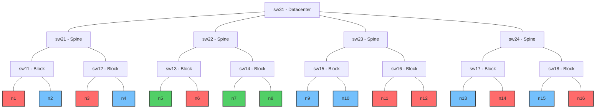
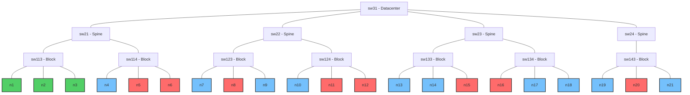
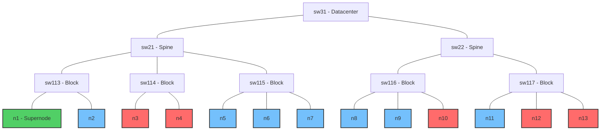

# Benchmarki

Ten katalog zawiera benchmarki dla porównania i oceny wydajności następujących systemów zarządzania obciążeniem i schedulerów:

- Kueue
- Volcano
- YuniKorn

Benchmarki te służą do oceny różnych aspektów wydajności schedulerów pod kątem przepustowości, skalowalności, świadomości topologii sieci oraz sprawiedliwego podziału zasobów.

## Wydajność i Skalowalność (Performance & Scalability)

Benchmarki wydajności dostarczają kompleksowej oceny framework'ów schedulerów w różnych wzorcach obciążeń, mierząc przepustowość, skalowalność i efektywność wykorzystania zasobów. Testy te symulują różne scenariusze, które mogą wystąpić w rzeczywistych środowiskach produkcyjnych.

### V1: Duża liczba identycznych, niezależnych jobów

Benchmark testuje zdolność schedulera do obsługi dużej liczby identycznych, niezależnych zadań. Mierzy wydajność i skalowalność schedulera i efektywność w obsłudze wielu małych zadań.

#### Konfiguracje

Benchmark zawiera wiele konfiguracji z różnymi kombinacjami liczby węzłów i zadań:

##### Liczba jobów: 300

- **300 węzłów**: Test 300 jobów na 300 węzłach
- **400 węzłów**: Test 300 jobów na 400 węzłach
- **500 węzłów**: Test 300 jobów na 500 węzłach

##### Liczba jobów: 400

- **300 węzłów**: Test 400 jobów na 300 węzłach
- **400 węzłów**: Test 400 jobów na 400 węzłach
- **500 węzłów**: Test 400 jobów na 500 węzłach

##### Liczba jobów: 500

- **300 węzłów**: Test 500 jobów na 300 węzłach
- **400 węzłów**: Test 500 jobów na 400 węzłach
- **500 węzłów**: Test 500 jobów na 500 węzłach

Każda konfiguracja testu wykorzystuje:

- Wirtualne węzły, każdy z 128 rdzeniami CPU, 1Ti pamięci i 8 GPU
- Niezależne joby, gdzie każdy składa się z pojedynczego poda o wymaganiach:
  - 16 rdzeni CPU (12,5% węzła)
  - 256Gi pamięci (25% węzła)
  - 4 GPU (50% węzła)

Wykorzystanie zasobów klastra różni się w zależności od konfiguracji:

| Konfiguracja | Wykorzystanie CPU | Wykorzystanie pamięci | Wykorzystanie GPU |
|---------------|-----------|-------------|-----------|
| 300 jobów, 300 węzłów | 12,5% | 25% | 50% |
| 300 jobów, 400 węzłów | 9,38% | 18,75% | 37,5% |
| 300 jobów, 500 węzłów | 7,5% | 15% | 30% |
| 400 jobów, 300 węzłów | 16,67% | 33,33% | 66,67% |
| 400 jobów, 400 węzłów | 12,5% | 25% | 50% |
| 400 jobów, 500 węzłów | 10% | 20% | 40% |
| 500 jobów, 300 węzłów | 20,83% | 41,67% | 83,33% |
| 500 jobów, 400 węzłów | 15,63% | 31,25% | 62,5% |
| 500 jobów, 500 węzłów | 12,5% | 25% | 50% |

**Skrypty do uruchomienia**:

```bash
# Dla Kueue
./bin/knavigator -workflow "resources/benchmarks/performance/workflows/kueue-v1-300-300.yaml"
./bin/knavigator -workflow "resources/benchmarks/performance/workflows/kueue-v1-300-400.yaml"
./bin/knavigator -workflow "resources/benchmarks/performance/workflows/kueue-v1-300-500.yaml"
./bin/knavigator -workflow "resources/benchmarks/performance/workflows/kueue-v1-400-300.yaml"
./bin/knavigator -workflow "resources/benchmarks/performance/workflows/kueue-v1-400-400.yaml"
./bin/knavigator -workflow "resources/benchmarks/performance/workflows/kueue-v1-400-500.yaml"
./bin/knavigator -workflow "resources/benchmarks/performance/workflows/kueue-v1-500-300.yaml"
./bin/knavigator -workflow "resources/benchmarks/performance/workflows/kueue-v1-500-400.yaml"
./bin/knavigator -workflow "resources/benchmarks/performance/workflows/kueue-v1-500-500.yaml"

# Dla Volcano
./bin/knavigator -workflow "resources/benchmarks/performance/workflows/volcano-v1-300-300.yaml"
./bin/knavigator -workflow "resources/benchmarks/performance/workflows/volcano-v1-300-400.yaml"
./bin/knavigator -workflow "resources/benchmarks/performance/workflows/volcano-v1-300-500.yaml"
./bin/knavigator -workflow "resources/benchmarks/performance/workflows/volcano-v1-400-300.yaml"
./bin/knavigator -workflow "resources/benchmarks/performance/workflows/volcano-v1-400-400.yaml"
./bin/knavigator -workflow "resources/benchmarks/performance/workflows/volcano-v1-400-500.yaml"
./bin/knavigator -workflow "resources/benchmarks/performance/workflows/volcano-v1-500-300.yaml"
./bin/knavigator -workflow "resources/benchmarks/performance/workflows/volcano-v1-500-400.yaml"
./bin/knavigator -workflow "resources/benchmarks/performance/workflows/volcano-v1-500-500.yaml"

# Dla YuniKorn
./bin/knavigator -workflow "resources/benchmarks/performance/workflows/yunikorn-v1-300-300.yaml"
./bin/knavigator -workflow "resources/benchmarks/performance/workflows/yunikorn-v1-300-400.yaml"
./bin/knavigator -workflow "resources/benchmarks/performance/workflows/yunikorn-v1-300-500.yaml"
./bin/knavigator -workflow "resources/benchmarks/performance/workflows/yunikorn-v1-400-300.yaml"
./bin/knavigator -workflow "resources/benchmarks/performance/workflows/yunikorn-v1-400-400.yaml"
./bin/knavigator -workflow "resources/benchmarks/performance/workflows/yunikorn-v1-400-500.yaml"
./bin/knavigator -workflow "resources/benchmarks/performance/workflows/yunikorn-v1-500-300.yaml"
./bin/knavigator -workflow "resources/benchmarks/performance/workflows/yunikorn-v1-500-400.yaml"
./bin/knavigator -workflow "resources/benchmarks/performance/workflows/yunikorn-v1-500-500.yaml"
```

### V2: Jeden duży wielopodowy job

Benchmark testuje efektywność schedulera w obsłudze zadań składających się z wielu podów. Ocenia, jak dobrze scheduler radzi sobie z dużym, spójnym obciążeniem.

#### Konfiguracje

Benchmark zawiera wiele konfiguracji z różnymi kombinacjami liczby węzłów i podów w zadaniu:

##### Liczba replik: 300

- **300 węzłów**: Test 1 joba z 300 replikami na 300 węzłach
- **400 węzłów**: Test 1 joba z 300 replikami na 400 węzłach
- **500 węzłów**: Test 1 joba z 300 replikami na 500 węzłach

##### Liczba replik: 400

- **300 węzłów**: Test 1 joba z 400 replikami na 300 węzłach
- **400 węzłów**: Test 1 joba z 400 replikami na 400 węzłach
- **500 węzłów**: Test 1 joba z 400 replikami na 500 węzłach

##### Liczba replik: 500

- **300 węzłów**: Test 1 joba z 500 replikami na 300 węzłach
- **400 węzłów**: Test 1 joba z 500 replikami na 400 węzłach
- **500 węzłów**: Test 1 joba z 500 replikami na 500 węzłach

Każda konfiguracja testu wykorzystuje:

- Wirtualne węzły, każdy z 128 rdzeniami CPU, 1Ti pamięci i 8 GPU
- Jeden wielopodowy job, gdzie każdy pod ma wymagania:
  - 16 rdzeni CPU (12,5% węzła)
  - 256Gi pamięci (25% węzła)
  - 4 GPU (50% węzła)

Wykorzystanie zasobów klastra różni się w zależności od konfiguracji:

| Konfiguracja | Wykorzystanie CPU | Wykorzystanie pamięci | Wykorzystanie GPU |
|---------------|-----------|-------------|-----------|
| 300 replik, 300 węzłów | 12,5% | 25% | 50% |
| 300 replik, 400 węzłów | 9,38% | 18,75% | 37,5% |
| 300 replik, 500 węzłów | 7,5% | 15% | 30% |
| 400 replik, 300 węzłów | 16,67% | 33,33% | 66,67% |
| 400 replik, 400 węzłów | 12,5% | 25% | 50% |
| 400 replik, 500 węzłów | 10% | 20% | 40% |
| 500 replik, 300 węzłów | 20,83% | 41,67% | 83,33% |
| 500 replik, 400 węzłów | 15,63% | 31,25% | 62,5% |
| 500 replik, 500 węzłów | 12,5% | 25% | 50% |

**Skrypty do uruchomienia**:

```bash
# Dla Kueue
./bin/knavigator -workflow "resources/benchmarks/performance/workflows/v2/kueue-v2-300-300.yaml"
./bin/knavigator -workflow "resources/benchmarks/performance/workflows/v2/kueue-v2-300-400.yaml"
./bin/knavigator -workflow "resources/benchmarks/performance/workflows/v2/kueue-v2-300-500.yaml"
./bin/knavigator -workflow "resources/benchmarks/performance/workflows/v2/kueue-v2-400-300.yaml"
./bin/knavigator -workflow "resources/benchmarks/performance/workflows/v2/kueue-v2-400-400.yaml"
./bin/knavigator -workflow "resources/benchmarks/performance/workflows/v2/kueue-v2-400-500.yaml"
./bin/knavigator -workflow "resources/benchmarks/performance/workflows/v2/kueue-v2-500-300.yaml"
./bin/knavigator -workflow "resources/benchmarks/performance/workflows/v2/kueue-v2-500-400.yaml"
./bin/knavigator -workflow "resources/benchmarks/performance/workflows/v2/kueue-v2-500-500.yaml"

# Dla Volcano
./bin/knavigator -workflow "resources/benchmarks/performance/workflows/v2/volcano-v2-300-300.yaml"
./bin/knavigator -workflow "resources/benchmarks/performance/workflows/v2/volcano-v2-300-400.yaml"
./bin/knavigator -workflow "resources/benchmarks/performance/workflows/v2/volcano-v2-300-500.yaml"
./bin/knavigator -workflow "resources/benchmarks/performance/workflows/v2/volcano-v2-400-300.yaml"
./bin/knavigator -workflow "resources/benchmarks/performance/workflows/v2/volcano-v2-400-400.yaml"
./bin/knavigator -workflow "resources/benchmarks/performance/workflows/v2/volcano-v2-400-500.yaml"
./bin/knavigator -workflow "resources/benchmarks/performance/workflows/v2/volcano-v2-500-300.yaml"
./bin/knavigator -workflow "resources/benchmarks/performance/workflows/v2/volcano-v2-500-400.yaml"
./bin/knavigator -workflow "resources/benchmarks/performance/workflows/v2/volcano-v2-500-500.yaml"

# Dla YuniKorn
./bin/knavigator -workflow "resources/benchmarks/performance/workflows/v2/yunikorn-v2-300-300.yaml"
./bin/knavigator -workflow "resources/benchmarks/performance/workflows/v2/yunikorn-v2-300-400.yaml"
./bin/knavigator -workflow "resources/benchmarks/performance/workflows/v2/yunikorn-v2-300-500.yaml"
./bin/knavigator -workflow "resources/benchmarks/performance/workflows/v2/yunikorn-v2-400-300.yaml"
./bin/knavigator -workflow "resources/benchmarks/performance/workflows/v2/yunikorn-v2-400-400.yaml"
./bin/knavigator -workflow "resources/benchmarks/performance/workflows/v2/yunikorn-v2-400-500.yaml"
./bin/knavigator -workflow "resources/benchmarks/performance/workflows/v2/yunikorn-v2-500-300.yaml"
./bin/knavigator -workflow "resources/benchmarks/performance/workflows/v2/yunikorn-v2-500-400.yaml"
./bin/knavigator -workflow "resources/benchmarks/performance/workflows/v2/yunikorn-v2-500-500.yaml"
```

### V3: Mieszane stopniowe obciążenie

Benchmark testuje wydajność schedulera z różnorodnymi obciążeniami, które lepiej reprezentują rzeczywiste wzorce użytkowania klastra. Ocenia, jak dobrze scheduler radzi sobie z heterogenicznymi typami zadań o różnych wymaganiach zasobowych jednocześnie.

**Konfiguracja testu**:

- 300 wirtualnych węzłów, każdy z 128 rdzeniami CPU, 1Ti pamięci i 8 GPU
- Trzy różne typy zadań uruchamiane równolegle:

  - **Zadania o wysokim użyciu GPU**: 100 jobów wykorzystujących całe węzły GPU (8 GPU na job)

    - 16 rdzeni CPU (12,5% węzła)
    - 96Gi pamięci (9,4% węzła)
    - 8 GPU (100% węzła)

  - **Zadania o średnim użyciu GPU**: 100 jobów z częściowym wykorzystaniem GPU (2 GPU na job)

    - 8 rdzeni CPU (6,25% węzła)
    - 32Gi pamięci (3,1% węzła)
    - 2 GPU (25% węzła)

  - **Zadania CPU-only**: 100 jobów bez wymagań GPU

    - 32 rdzenie CPU (25% węzła)
    - 128Gi pamięci (12,5% węzła)
    - 0 GPU

**Skrypty do uruchomienia**:

```bash
# Dla Kueue
./bin/knavigator -workflow "resources/benchmarks/performance/workflows/kueue-v3.yaml"

# Dla Volcano
./bin/knavigator -workflow "resources/benchmarks/performance/workflows/volcano-v3.yaml"

# Dla YuniKorn
./bin/knavigator -workflow "resources/benchmarks/performance/workflows/yunikorn-v3.yaml"
```

## Świadomość topologii klastra (Topology Awareness)

Benchmark Topology Aware ocenia zdolność schedulera do inteligentnego rozmieszczania podów w oparciu o topologię sieci. Ta funkcjonalność jest kluczowa dla rozproszonych obciążeń, takich jak trening deep learning, gdzie opóźnienie komunikacji między podami może znacząco wpływać na wydajność.

Testy tworzą symulowaną topologię sieci z różnymi warstwami (datacenter, spine, block) i sprawdzają, jak dobrze scheduler potrafi umieszczać pody, aby zminimalizować odległości sieciowe między współpracującymi podami.

Benchmarki są zaimplementowane dla Kueue i Volcano, ponieważ YuniKorn nie wspiera obecnie planowania opartego na topologii sieci.

### V1: Planowanie na 2 poziomie hierarchii (spine)

Test konfiguruje 16 węzłów w układzie drzewiastym reprezentującym topologię sieci:



Na tym diagramie:

- Węzły n1, n3, n6, n11, n12, n14 i n16 są oznaczone jako nieplanowalne (X)
- Węzły n5, n7 i n8 są oznaczone jako "optymalne" ze względu na topologię sieci (pod sw22)

**Test**:

- **Konfiguracja węzłów**: Test tworzy 16 wirtualnych węzłów z etykietami topologii sieci na różnych poziomach:

  - network.topology.kubernetes.io/datacenter: Segment sieci najwyższego poziomu
  - network.topology.kubernetes.io/spine: Segment sieci średniego poziomu
  - network.topology.kubernetes.io/block: Segment sieci najniższego poziomu

- **Obciążenie: Test przeprowadza dwie fazy**:

  - Uruchamia job z 3 podami używając strategii *"required" (Kueue) / "hard" (Volcano)* na poziomie spine
  - Uruchamia ten sam job z 3 podami używając strategii *"preferred" (Kueue) / "soft" (Volcano)* na poziomie spine

- **Ocena**: Sukces jest mierzony zdolnością schedulera do umieszczenia wszystkich podów na optymalnych węzłach (n5, n7, n8), które zostały oznaczone etykietą "ta-optimal: true" i mają najmniejszą odległość sieciową między sobą.

**Skrypty do uruchomienia**:

```sh
# Dla Kueue
./bin/knavigator -workflow 'resources/benchmarks/topology-aware/workflows/kueue-v1.yaml'

# Dla Volcano
./bin/knavigator -workflow 'resources/benchmarks/topology-aware/workflows/volcano-v1.yaml'
```

### V2: Planowanie na 1 poziomie hierarchii (block)

Benchmark konfiguruje 21 węzłów w bardziej złożonym układzie drzewiastym:



Na tym diagramie:

- Węzły n5, n6, n8, n11, n12, n15, n16 i n20 są oznaczone jako nieplanowalne (X)
- Węzły n1, n2 i n3 znajdują się w tym samym bloku sieci (sw113) i są oznaczone jako "optymalne"

**Test**:

- **Konfiguracja węzłów**: Podobna do V1, ale z inną strukturą topologii, gdzie optymalne węzły znajdują się wszystkie w tym samym bloku sieci, zapewniając najmniejsze możliwe opóźnienie dla komunikacji między podami.

- **Obciążenie**: Test przeprowadza dwie sekwencyjne próby planowania na poziomie bloku (network.topology.kubernetes.io/block):

  - Job z 3 podami używający strategii *"required" (Kueue) /"hard" (Volcano)* (twarde ograniczenie, które musi być spełnione do zaplanowania)

  - Job z 3 podami używający strategii *"preferred" (Kueue) /"soft" (Volcano)* (miękkie ograniczenie, które scheduler powinien starać się spełnić)

- **Ocena**: Sukces jest mierzony przez zdolność schedulera do umieszczenia wszystkich podów na optymalnych węzłach (n1, n2, n3) dla obu trybów planowania. Test sprawdza zarówno zdolność schedulera do honorowania preferencji topologii, gdy jest to możliwe, jak i do egzekwowania ścisłych wymagań topologicznych, gdy jest to konieczne.

**Skrypty do uruchomienia**:

```sh
# Dla Kueue
./bin/knavigator -workflow 'resources/benchmarks/topology-aware/workflows/kueue-v2.yaml'

# Dla Volcano
./bin/knavigator -workflow 'resources/benchmarks/topology-aware/workflows/volcano-v2.yaml'
```

### V3: Planowanie na 0 poziomie hierarchii (node)

Benchmark konfiguruje 13 węzłów z topologią sieci, która zawiera "superwęzeł" o wysokiej pojemności oraz wiele zwykłych węzłów:



Na tym diagramie:

- Węzeł n1 to "superwęzeł" o wysokiej pojemności (24 GPU, 256 rdzeni CPU), zdolny do hostowania wszystkich podów zasobochłonnego joba
- Zwykłe węzły mają standardową pojemność (8 GPU, 128 rdzeni CPU)
- Węzły n3, n4, n10, n12 i n13 są oznaczone jako nieplanowalne (X)
- Blok sw116 ma 2 dostępne węzły (n8, n9) i 1 niedostępny (n10)
- Blok sw117 ma 1 dostępny węzeł (n11) i 2 niedostępne (n12, n13)
- Wszystkie węzły w bloku sw115 (n5, n6, n7) są dostępne do planowania

**Test**:

- **Faza 1 - Umieszczanie na pojedynczym węźle**:

  - Test tworzy job z 3 podami, każdy wymagający 6 GPU (łącznie 18 GPU) z preferencją topologii na poziomie węzła używający strategii *"required" (Kueue) /"hard" (Volcano)* (twarde ograniczenie, które musi być spełnione do zaplanowania)
  - Wszystkie pody powinny być zaplanowane na superwęźle (n1)
  - Test sprawdza zdolność schedulera do konsolidacji podów na pojedynczym węźle, gdy zasoby na to pozwalają i preferencje topologii to sugerują
  - Zwykłe węzły (8 GPU każdy) wymagałyby wielu węzłów do spełnienia żądania

- **Faza 2 - Dystrybucja na wielu węzłach**:

  - Superwęzeł zostaje oznaczony jako nieplanowany
  - Nowy job z identycznymi wymaganiami zasobowymi jest uruchamiany z preferencją topologii na poziomie węzła używający strategii *"preferred" (Kueue) /"soft" (Volcano)* (miękkie ograniczenie, które scheduler powinien starać się spełnić)
  - Ponieważ niemożliwe jest umieszczenie na jednym węźle, pody powinny być teraz rozłożone na dostępnych węzłach w bloku sw115, bo jest to drugi najniższy, możliwy poziom hierarchii, na którym zmieszą się wszystkie pody joba.
  - Test sprawdza zdolność schedulera do dystrybucji podów na wielu węzłach, zachowując je w tym samym bloku sieciowym, gdy pojedynczy węzeł nie jest dostępny

- **Ocena**:

  - Sukces jest mierzony zdolnością schedulera do prawidłowego umieszczenia wszystkich podów na superwęźle w fazie 1
  - I zdolnością do dystrybucji podów na wielu węzłach w tym samym bloku w fazie 2

**Skrypty do uruchomienia**:

```sh
# Dla Kueue
./bin/knavigator -workflow 'resources/benchmarks/topology-aware/workflows/kueue-v3.yaml'

# Dla Volcano
./bin/knavigator -workflow 'resources/benchmarks/topology-aware/workflows/volcano-v3.yaml'
```

## Sprawiedliwy przydział zasobów (Fair Share)

Benchmarki oceniają zdolność schedulerów do sprawiedliwego podziału zasobów między różnymi kolejkami i zadaniami. Testują, czy scheduler prawidłowo dostosowuje się do priorytetów zadań i zapobiega monopolizacji zasobów przez pojedyncze zadania lub grupy.

### V1: Równy podział przy identycznych wagach

**Opis**: Sprawdza, czy scheduler prawidłowo implementuje sprawiedliwy podział zasobów między najemcami (tenants) o identycznych wagach.

**Konfiguracja**:

- Klaster z 5 węzłami, każdy z 15100m CPU (efektywnie 15000m CPU do dyspozycji na węzeł, ponieważ 100m jest zarezerwowane dla KWOK) oraz 15050Mi pamięci (efektywnie 15050Mi pamięci do dyspozycji na węzeł, ponieważ 50Mi jest zarezerwowane dla KWOK)

- Trzej najemcy (tenant-a, tenant-b, tenant-c) ze swoimi dedykowanymi przestrzeniami nazw

- Trzy ClusterQueue w kohorcie "fairshare-cohort", każda z identyczną wagą fair-sharing równą 1

- Każda kolejka ma gwarantowane 25000m CPU z możliwością:

  - Pożyczenia do 50000m CPU (50000Mi pamięci) od innych kolejek (borrowingLimit)
  - Udostępnienia do 25000m CPU (25000Mi pamięci) innym kolejkom (lendingLimit)

- Parametry preemption skonfigurowane tak, by umożliwić współdzielenie zasobów w kohorcie

**Działanie**:

- Sekwencyjnie przesyłane są zadania (30s pomiędzy tenantami) do każdej kolejki:

  - 75 identycznych zadań do tenant-a (każde żądające 1000m CPU i 1000Mi pamięci)
  - 75 identycznych zadań do tenant-b (każde żądające 1000m CPU i 1000Mi pamięci)
  - 75 identycznych zadań do tenant-c (każde żądające 1000m CPU i 1000Mi pamięci)

- Łącznie żądania przewyższają dostępne zasoby: 225000m CPU żądane vs. 75000m CPU dostępnych w klastrze

**Oczekiwany wynik**:

- Mechanizm fair-sharing powinien zapewnić równy podział dostępnych zasobów
- Każda kolejka powinna otrzymać około 25000m CPU (1/3 dostępnych zasobów)
- Dla każdej kolejki powinno zostać uruchomionych około 25 zadań, a pozostałe powinny oczekiwać w kolejce

### V2: Proporcjonalny podział przy różnych wagach

**Opis**: Weryfikuje proporcjonalny podział na podstawie wag.

**Konfiguracja**:

- Kolejki: X (waga 3), Y (waga 2), Z (waga 1).

- Zasób klastra: 60 CPU (przykład: 3+2+1=6 jednostek wagi → 10 CPU na jednostkę).

**Działanie**:

- Prześlij zadania wymagające łącznie >60 CPU (np. X: 40 CPU, Y: 30 CPU, Z: 20 CPU).

**Oczekiwany wynik**:

- Kolejka X: 30 CPU (3/6 zasobów), Y: 20 CPU (2/6), Z: 10 CPU (1/6).

### V3: Dynamiczne zarządzanie nadmiarowymi zasobami

**Cel**: Sprawdź zdolność planisty do umożliwienia kolejkom wykorzystania nadmiarowych zasobów, gdy inne kolejki nie wykorzystują swoich udziałów, i powrotu do równych udziałów, gdy wszystkie kolejki żądają zasobów.

**Konfiguracja**:

- Dwie kolejki (P, Q) z wagą 1.

- Zasób klastera: 100 CPU.

**Działanie**:

- Faza 1: Prześlij zadania tylko do kolejki P (np. wymagające 100 CPU).

- Faza 2: Po 5 minutach dodaj zadania do kolejki Q (również 100 CPU).

**Oczekiwany wynik**:

- Faza 1: Kolejka P wykorzystuje >90% CPU przez pierwsze 5 minut.

- Faza 2: W ciągu 2–3 minut od dodania zadań do Q, alokacja stabilizuje się na poziomie ~50% dla każdej kolejki.

### V4: Hierarchia kolejek z wagami na wielu poziomach

**Opis**: Ten scenariusz testuje mechanizm sprawiedliwego podziału w strukturze hierarchicznych kolejek, upewniając się, że alokacja zasobów respektuje hierarchię i wagi na różnych poziomach.

**Konfiguracja**:

- Kolejka główna G (waga 2) z pod-kolejkami:

  - G1 (waga 3)

  - G2 (waga 1)

- Kolejka równoległa H (waga 1).

- Zasób klastra: 120 CPU.

**Działanie**:

- Prześlij zadania do G1, G2 i H, każda wymagająca 80 CPU.

**Oczekiwany wynik**:

- Kolejka główna G otrzymuje 2/3 zasobów (80 CPU), a H 1/3 (40 CPU) – zgodnie z wagami G:H = 2:1.

- W ramach G: G1 otrzymuje 3/4 z 80 CPU (60 CPU), G2 1/4 (20 CPU) – zgodnie z wagami G1:G2 = 3:1.
