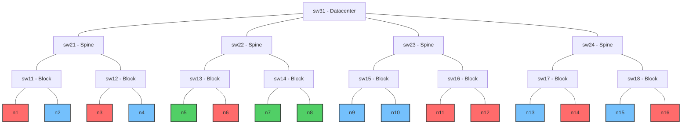
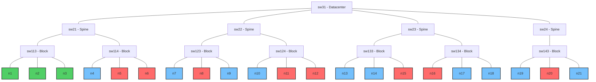
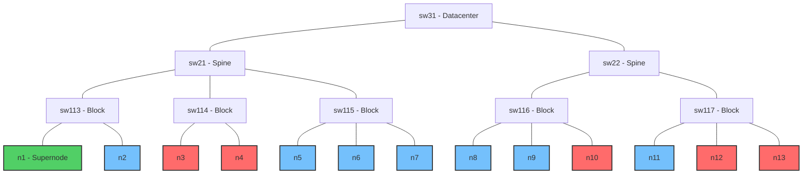

# Benchmarki

Ten katalog zawiera benchmarki dla porównania i oceny wydajności następujących systemów zarządzania obciążeniem i schedulerów:

- Kueue
- Volcano
- YuniKorn

Benchmarki te służą do oceny różnych aspektów wydajności schedulerów pod kątem przepustowości, skalowalności, świadomości topologii sieci oraz sprawiedliwego podziału zasobów.

## Wydajność (Performance)

Benchmarki wydajności dostarczają kompleksowej oceny framework'ów schedulerów w różnych wzorcach obciążeń, mierząc przepustowość, skalowalność i efektywność wykorzystania zasobów. Testy te symulują różne scenariusze, które mogą wystąpić w rzeczywistych środowiskach produkcyjnych.

### V1: Duża liczba identycznych, niezależnych jobów

Benchmark testuje zdolność schedulera do obsługi dużej liczby identycznych, niezależnych zadań. Mierzy przepustowość schedulera i efektywność w obsłudze wielu małych zadań.

**Konfiguracja testu**:

- 300 wirtualnych węzłów, każdy z 128 rdzeniami CPU, 1Ti pamięci i 8 GPU
- 300 niezależnych jobów, gdzie każdy składa się z pojedynczego poda o wymaganiach:

  - 16 rdzeni CPU (12,5% węzła)
  - 256Gi pamięci (25% węzła)
  - 4 GPU (50% węzła)

**Skrypty do uruchomienia**:

```bash
# Dla Kueue
./bin/knavigator -workflow "resources/benchmarks/performance/workflows/kueue-v1.yaml" -v 4

# Dla Volcano
./bin/knavigator -workflow "resources/benchmarks/performance/workflows/volcano-v1.yaml" -v 4

# Dla YuniKorn
./bin/knavigator -workflow "resources/benchmarks/performance/workflows/yunikorn-v1.yaml" -v 4
```

### V2: Jeden duży wielopodowy job

Benchmark testuje efektywność schedulera w obsłudze zadań składających się z wielu podów. Ocenia, jak dobrze scheduler radzi sobie z dużym, spójnym obciążeniem.

**Konfiguracja testu**:

- 300 wirtualnych węzłów, każdy z 128 rdzeniami CPU, 1Ti pamięci i 8 GPU
- Jeden job z 300 podami, gdzie każdy ma wymagania:

  - 16 rdzeni CPU (12,5% węzła)
  - 256Gi pamięci (25% węzła)
  - 4 GPU (50% węzła)

**Skrypty do uruchomienia**:

```bash
# Dla Kueue
./bin/knavigator -workflow "resources/benchmarks/performance/workflows/kueue-v2.yaml" -v 4

# Dla Volcano
./bin/knavigator -workflow "resources/benchmarks/performance/workflows/volcano-v2.yaml" -v 4

# Dla YuniKorn
./bin/knavigator -workflow "resources/benchmarks/performance/workflows/yunikorn-v2.yaml" -v 4
```

### V3: Mieszane stopniowe obciążenie

Benchmark testuje wydajność schedulera z różnorodnymi obciążeniami, które lepiej reprezentują rzeczywiste wzorce użytkowania klastra. Ocenia, jak dobrze scheduler radzi sobie z heterogenicznymi typami zadań o różnych wymaganiach zasobowych jednocześnie.

**Konfiguracja testu**:

- 300 wirtualnych węzłów, każdy z 128 rdzeniami CPU, 1Ti pamięci i 8 GPU
- Trzy różne typy zadań uruchamiane równolegle:

  - **Zadania o wysokim użyciu GPU**: 100 jobów wykorzystujących całe węzły GPU (8 GPU na job)

    - 16 rdzeni CPU (12,5% węzła)
    - 96Gi pamięci (9,4% węzła)
    - 8 GPU (100% węzła)

  - **Zadania o średnim użyciu GPU**: 100 jobów z częściowym wykorzystaniem GPU (2 GPU na job)

    - 8 rdzeni CPU (6,25% węzła)
    - 32Gi pamięci (3,1% węzła)
    - 2 GPU (25% węzła)

  - **Zadania CPU-only**: 100 jobów bez wymagań GPU

    - 32 rdzenie CPU (25% węzła)
    - 128Gi pamięci (12,5% węzła)
    - 0 GPU

**Skrypty do uruchomienia**:

```bash
# Dla Kueue
./bin/knavigator -workflow "resources/benchmarks/performance/workflows/kueue-v3.yaml" -v 4

# Dla Volcano
./bin/knavigator -workflow "resources/benchmarks/performance/workflows/volcano-v3.yaml" -v 4

# Dla YuniKorn
./bin/knavigator -workflow "resources/benchmarks/performance/workflows/yunikorn-v3.yaml" -v 4
```

## Świadomość topologii klastra (Topology Awareness)

Benchmark Topology Aware ocenia zdolność schedulera do inteligentnego rozmieszczania podów w oparciu o topologię sieci. Ta funkcjonalność jest kluczowa dla rozproszonych obciążeń, takich jak trening deep learning, gdzie opóźnienie komunikacji między podami może znacząco wpływać na wydajność.

Testy tworzą symulowaną topologię sieci z różnymi warstwami (datacenter, spine, block) i sprawdzają, jak dobrze scheduler potrafi umieszczać pody, aby zminimalizować odległości sieciowe między współpracującymi podami.

Benchmarki są zaimplementowane dla Kueue i Volcano, ponieważ YuniKorn nie wspiera obecnie planowania opartego na topologii sieci.

### V1: Planowanie na 2 poziomie hierarchii (spine)

Test konfiguruje 16 węzłów w układzie drzewiastym reprezentującym topologię sieci:



Na tym diagramie:

- Węzły n1, n3, n6, n11, n12, n14 i n16 są oznaczone jako nieplanowalne (X)
- Węzły n5, n7 i n8 są oznaczone jako "optymalne" ze względu na topologię sieci (pod sw22)

**Test**:

- **Konfiguracja węzłów**: Test tworzy 16 wirtualnych węzłów z etykietami topologii sieci na różnych poziomach:

  - network.topology.kubernetes.io/datacenter: Segment sieci najwyższego poziomu
  - network.topology.kubernetes.io/spine: Segment sieci średniego poziomu
  - network.topology.kubernetes.io/block: Segment sieci najniższego poziomu

- **Obciążenie: Test przeprowadza dwie fazy**:

  - Uruchamia job z 3 podami używając strategii *"required" (Kueue) / "hard" (Volcano)* na poziomie spine
  - Uruchamia ten sam job z 3 podami używając strategii *"preferred" (Kueue) / "soft" (Volcano)* na poziomie spine

- **Ocena**: Sukces jest mierzony zdolnością schedulera do umieszczenia wszystkich podów na optymalnych węzłach (n5, n7, n8), które zostały oznaczone etykietą "ta-optimal: true" i mają najmniejszą odległość sieciową między sobą.

**Skrypty do uruchomienia**:

```sh
# Dla Kueue
./bin/knavigator -workflow 'resources/benchmarks/topology-aware/workflows/kueue-v1.yaml'

# Dla Volcano
./bin/knavigator -workflow 'resources/benchmarks/topology-aware/workflows/volcano-v1.yaml'
```

### V2: Planowanie na 1 poziomie hierarchii (block)

Benchmark konfiguruje 21 węzłów w bardziej złożonym układzie drzewiastym:



Na tym diagramie:

- Węzły n5, n6, n8, n11, n12, n15, n16 i n20 są oznaczone jako nieplanowalne (X)
- Węzły n1, n2 i n3 znajdują się w tym samym bloku sieci (sw113) i są oznaczone jako "optymalne"

**Test**:

- **Konfiguracja węzłów**: Podobna do V1, ale z inną strukturą topologii, gdzie optymalne węzły znajdują się wszystkie w tym samym bloku sieci, zapewniając najmniejsze możliwe opóźnienie dla komunikacji między podami.

- **Obciążenie**: Test przeprowadza dwie sekwencyjne próby planowania na poziomie bloku (network.topology.kubernetes.io/block):

  - Job z 3 podami używający strategii *"required" (Kueue) /"hard" (Volcano)* (twarde ograniczenie, które musi być spełnione do zaplanowania)

  - Job z 3 podami używający strategii *"preferred" (Kueue) /"soft" (Volcano)* (miękkie ograniczenie, które scheduler powinien starać się spełnić)

- **Ocena**: Sukces jest mierzony przez zdolność schedulera do umieszczenia wszystkich podów na optymalnych węzłach (n1, n2, n3) dla obu trybów planowania. Test sprawdza zarówno zdolność schedulera do honorowania preferencji topologii, gdy jest to możliwe, jak i do egzekwowania ścisłych wymagań topologicznych, gdy jest to konieczne.

**Skrypty do uruchomienia**:

```sh
# Dla Kueue
./bin/knavigator -workflow 'resources/benchmarks/topology-aware/workflows/kueue-v2.yaml'

# Dla Volcano
./bin/knavigator -workflow 'resources/benchmarks/topology-aware/workflows/volcano-v2.yaml'
```

### V3: Planowanie na 0 poziomie hierarchii (node)

Benchmark konfiguruje 13 węzłów z topologią sieci, która zawiera "superwęzeł" o wysokiej pojemności oraz wiele zwykłych węzłów:



Na tym diagramie:

- Węzeł n1 to "superwęzeł" o wysokiej pojemności (24 GPU, 256 rdzeni CPU), zdolny do hostowania wszystkich podów zasobochłonnego joba
- Zwykłe węzły mają standardową pojemność (8 GPU, 128 rdzeni CPU)
- Węzły n3, n4, n10, n12 i n13 są oznaczone jako nieplanowalne (X)
- Blok sw116 ma 2 dostępne węzły (n8, n9) i 1 niedostępny (n10)
- Blok sw117 ma 1 dostępny węzeł (n11) i 2 niedostępne (n12, n13)
- Wszystkie węzły w bloku sw115 (n5, n6, n7) są dostępne do planowania

**Test**:

- **Faza 1 - Umieszczanie na pojedynczym węźle**:

  - Test tworzy job z 3 podami, każdy wymagający 6 GPU (łącznie 18 GPU) z preferencją topologii na poziomie węzła używający strategii *"required" (Kueue) /"hard" (Volcano)* (twarde ograniczenie, które musi być spełnione do zaplanowania)
  - Wszystkie pody powinny być zaplanowane na superwęźle (n1)
  - Test sprawdza zdolność schedulera do konsolidacji podów na pojedynczym węźle, gdy zasoby na to pozwalają i preferencje topologii to sugerują
  - Zwykłe węzły (8 GPU każdy) wymagałyby wielu węzłów do spełnienia żądania

- **Faza 2 - Dystrybucja na wielu węzłach**:

  - Superwęzeł zostaje oznaczony jako nieplanowany
  - Nowy job z identycznymi wymaganiami zasobowymi jest uruchamiany z preferencją topologii na poziomie węzła używający strategii *"preferred" (Kueue) /"soft" (Volcano)* (miękkie ograniczenie, które scheduler powinien starać się spełnić)
  - Ponieważ niemożliwe jest umieszczenie na jednym węźle, pody powinny być teraz rozłożone na dostępnych węzłach w bloku sw115, bo jest to drugi najniższy, możliwy poziom hierarchii, na którym zmieszą się wszystkie pody joba.
  - Test sprawdza zdolność schedulera do dystrybucji podów na wielu węzłach, zachowując je w tym samym bloku sieciowym, gdy pojedynczy węzeł nie jest dostępny

- **Ocena**:

  - Sukces jest mierzony zdolnością schedulera do prawidłowego umieszczenia wszystkich podów na superwęźle w fazie 1
  - I zdolnością do dystrybucji podów na wielu węzłach w tym samym bloku w fazie 2

**Skrypty do uruchomienia**:

```sh
# Dla Kueue
./bin/knavigator -workflow 'resources/benchmarks/topology-aware/workflows/kueue-v3.yaml'

# Dla Volcano
./bin/knavigator -workflow 'resources/benchmarks/topology-aware/workflows/volcano-v3.yaml'
```

## Sprawiedliwy przydział zasobów (Fair Share)

Benchmarki oceniają zdolność schedulerów do sprawiedliwego podziału zasobów między różnymi kolejkami i zadaniami. Testują, czy scheduler prawidłowo dostosowuje się do priorytetów zadań i zapobiega monopolizacji zasobów przez pojedyncze zadania lub grupy.

### V1: Równy podział zasobów między kolejkami o tej samej wadze

Cel: Sprawdź, czy kolejki z identycznymi wagami otrzymują równe udziały zasobów klastra, gdy konkurują o nie.
Konfiguracja: Utwórz kilka kolejek z taką samą wagą. Prześlij zadania do każdej kolejki, które żądają zasobów, tak aby całkowite zapotrzebowanie przekraczało pojemność klastra.
Wykonanie: Monitoruj alokację zasobów dla każdej kolejki w czasie.
Oczekiwany wynik: Każda kolejka powinna otrzymać mniej więcej taką samą ilość zasobów.

### V2: Proporcjonalny podział zasobów na podstawie wag kolejek

Cel: Potwierdź, że kolejki z różnymi wagami otrzymują zasoby proporcjonalnie do przypisanych wag.
Konfiguracja: Utwórz trzy kolejki z różnymi wagami (np. kolejka A z wagą 3, kolejka B z wagą 2 i kolejka C z wagą 1). Prześlij zadania do każdej kolejki, które żądają zasobów, z całkowitym zapotrzebowaniem przekraczającym pojemność.
Wykonanie: Obserwuj alokację zasobów dla każdej kolejki.
Oczekiwany wynik: Kolejka A powinna otrzymać około trzy razy więcej zasobów niż kolejka B.

### V3: Wykorzystanie nadmiarowych zasobów z zasadą fair share

Cel: Sprawdź zdolność planisty do umożliwienia kolejkom wykorzystania nadmiarowych zasobów, gdy inne kolejki nie wykorzystują swoich udziałów, i powrotu do równych udziałów, gdy wszystkie kolejki żądają zasobów.
Konfiguracja: Utwórz dwie kolejki z równymi wagami. Na początku prześlij zadania tylko do kolejki A. Później zacznij przesyłać zadania do kolejki B.
Wykonanie: Faza pierwsza: Monitoruj użycie zasobów, gdy tylko kolejka A ma zadania. Kolejka A powinna móc wykorzystać więcej niż swój sprawiedliwy udział. Faza druga: Po przesłaniu zadań do kolejki B, monitoruj, jak planista dostosowuje alokację zasobów.
Oczekiwany wynik: Na początku kolejka A wykorzystuje więcej niż 50% zasobów. Po rozpoczęciu zadań kolejki B, alokacja zasobów powinna się wyrównać do około 50% dla każdej kolejki.
